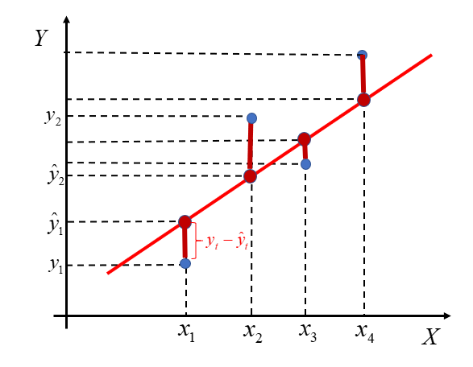

```{r setup, include=FALSE}
knitr::opts_chunk$set(echo = F, warning = F )

## https://pogotowiestatystyczne.pl/jak-analizowac-wyniki-badan-przy-uzyciu-ankiety-wlasnego-autorstwa/
##
library("knitr")
library("ggplot2")
library("tidyverse")

##
sample.size <- 1000

## Rozkład średniej z próby w zależności od wielkości próby 
## Podejście empiryczne

mks <- function  (n, maxN) {
  ## w is global
  sample <- rep(0, sample.size)
  for(i in 1:sample.size) {
    s <- floor(runif(n, min=0, max=maxN))
    sample[i] <- mean(w[s])
  }
  return (sample)
}

diffMx <- function (s, t)  { 
  ## sample (vector) - true_mean
  mean.diff <- s - t
## 10% błąd wagi
  max.err <- 0.1 * true.mean.w 

  return ( sum(abs(mean.diff) > max.err) )
  }


```

# Przedmiot, metody i organizacja badań statystycznych

## Przedmiot statystyki

Wyraz statystyka ma wiele znaczeń: **statystyki zgonów** albo **statystyki
alkoholizmu** czyli **dane** dotyczące zgonów lub alhoholizmu.
Statystyka to też **dziedzina wiedzy**, upraszczając zbiór metod, które służą
do tworzenia statystyk w pierwszym znaczeniu tego słowa. 
Wreszcie statystyka to **pojedyncza metoda** ze zbioru metod opracowanych
w dziedzinie, np. średnia to statystyka. Trochę to niefortunne, ale
świat nie jest doskonały jak wiemy...

**Statystyka** (obiegowo): dział matematyki wzw z tym wiedza absolutnie
pewna i obiektywna. Nieprawda choćby z tego powodu,
że nie jest działem matematyki, korzysta z metod matematycznych jak wiele
innych dziedzin.

**Statystyka** od strony czysto praktycznej to: **dane** + **procedury**
(zbierania, przechowania, analizowania, prezentowania *danych*)
+ **programy**; Jeżeli statystyka kojarzy się komuś ze matematyką,
wzorami i liczeniem, to jak widać jest  to zaledwie podpunkt
procedury→analizowanie.

## Podstawowe pojęcia

Celem **badania statystycznego** jest uzyskanie informacji
o interesującym nas zjawisku na podstawie danych.
Zjawisko ma charakter masowy czyli dotyczy dużej liczby *obiektów*.
Nie interesuje nas jeden zgon (obiekt) tylko zgony wielu ludzi.

**Populacja** (**zbiorowość statystyczna**) to zbiór obiektów będący
przedmiotem badania statystycznego. Na przykład zgony w Polsce w roku 2022.

Każdy **obiekt** w populacji to 
**obserwacja** (zwana także **jednostką statystyczną** albo **pomiarem**)
na jednej lub więcej **zmiennych**.
Jeżeli interesującym zjawiskiem są zgony, obserwacją jest osoba zmarła
a zmiennymi wiek,
płeć oraz dzień tygodnia (w którym nastąpił zgon) zmarłej osoby.

**Próba** to część **populacji**.
Na przykład część zgonów w Polsce w roku 2022.

**Parametr**: wielkość numeryczna obliczona na podstawie populacji.

**Statystyka**: wielkość numeryczna obliczona na podstawie próby.

Populacja powinna być zdefiniowana w taki sposób aby nie było wątpliwości
co tak naprawdę jest badane. Zgony to w oczywisty sposób za mało.
*Zgony mieszkańców Kwidzyna w roku 2022*.

Zwróćmy uwagę, że *Zgony w mieście Kwidzyn w roku 2022* to nie to samo
(ktoś może być mieszkańcem
a umrzeć w Polsce i/lub ktoś może nie być mieszkańcem i umrzeć w Kwidzynie)

**Generalizacja**: ocena całości na podstawie części. Badamy zjawisko wypalenia
zawodowego pielęgniarek i pielęgniarzy w Polsce (populacja). Wobec zaporowych kosztów
mierzenia wszystkich decydujemy się na przeprowadzenie ankiety wśród studentów
pielęniarstwa PSW (próba). Czy możemy twierdzić na podstawie próby, że wyniki
badania dla całej Polski są identyczne? Raczej nie...

Próba która pozwala na generalizację nazywa się próbą reprezentatywną.
Najlepszym sposobem na uzyskanie
próby reprezentatywnej jest losowanie.

W oczywisty sposób badanie na podstawie próby jest tańsze niż badanie całości, co nie
oznacza że jest tanie. Kontynuując przykład: musielibyśmy mieć listę wszystkich 
pielęgniarek i pielęgniarzy w Polsce. Z tej listy wylosować próbą a następnie skontaktować
się z wybranymi osobami (jak?). Dlatego też badania w oparciu o próbę nielosową są całkiem
popularne (bo są tanie); należy jednakże mieć świadomość ich ograniczeń, w tym a zwłaszcza
uogólnienia uzyskanych wyników.

**Mądrość statystyczna** nt liczebności próby i wnioskowania z próby nierepreznetatywnej:
badano czy nowy preparat podnosi
nośność kur, w 33,3% przypadków podniósł w 33,3% przypadków nie
podniósł, a na 33,3 nie wiadomo, bo kura uciekła.

## Pomiar

**Pomiar** -- przyporządkowanie wariantom **zmiennej** liczb lub symboli.
Przykładowo jeżeli jednostką jest zgon a zmiennymi wiek, płeć i dzień tygodnia to
pomiar będzie polegał na ustaleniu (przyporządkowaniu) wieku w latach,
płci ('K'/'M'), oraz numeru dnia tygodnia (lub nazwy dnia tygodnia).
Wiek/numer są liczbami, płeć symbolem.

**Typy skal pomiarowych**:

* **nominalna** (*nominal scale*), klasyfikuje: płeć zmarłego;

* **porządkowa** (ordinal scale), klasyfikuje i porządkuje: dzień tygodnia
w którym nastąpił zgon (po poniedziałku jest wtorek);

* **liczbowa**, mierzy w potocznym tego słowa znaczeniu: wiek zmarłego w latach

Mówimy **zmienna mierzalna** albo **zmienna ilościowa** dla zmiennych mierzonych
za pomocą skali liczbowej.  Mówimy **zmienna niemierzalna** albo
**zmienna jakościowa** dla zmiennych mierzonych za pomocą skali
nominalnej/porządkowej.

Zmienne mierzalne dzielą się na **skokowe**
oraz **ciągłe**.  Skokowe są to cechy, które przyjmują skończoną liczbę
wartości, zwykle są to liczby całkowite; Ciągłe są to cechy, które
przyjmują dowolne wartości liczbowe z pewnego przedziału liczbowego, np. ciśnienie krwi.

**Rodzaje danych**

* Przekrojowe (zmarli)

* Czasowe: każda obserwacja ma przypisany czas (liczba zmarłych w Polsce w latach 2000--20222)

* Przestrzenne : każda obserwacja ma przypisane miejsce na kuli ziemskiej (współrzędne geograficzne)

## Rodzaje i sposoby analizy danych

Rodzaje **analizy statystycznej** zależą od rodzaju danych
(jakie mamy dane takie możemy stosować metody):

* jedna zmienna/dane przekrojowe: analiza struktury

* co najmniej dwie zmienne: analiza współzależności (nadwaga powoduje cukrzycę)

* dane czasowe: analiza dynamiki zjawiska

Sposoby analizy danych zależą od sposobu pomiaru (populacja/próba/generalizacja):

**Opis statystyczny** -- (proste) przedstawienie badanych zbiorowości/zmiennych
 tabel, wykresów lub parametrów (np. średnia, mediana) ;
 Opis statystyczny może dotyczyć: -- struktury zbiorowości; -- współzależności; --
 zmian zjawiska w czasie.

**Wnioskowanie**: wnioskowanie na temat całości na podstawie próby;
wykorzystuje metody analizy matematycznej

Opisujemy populację lub próbę. Wnioskujemy na podstawie próby o całości...

## Sposoby pomiaru danych i organizacja badania

**Dane**: pojęcie (zwykle) niedefiniowane na zasadzie jaki jest koń
  każden widzi. Mówiąc konkretnie: **symbole** w tym liczby.

Sposób pomiaru/organizacja badania ma zasadnicze znaczenie dla interpretacji wyników.
Są dwa fundamentalne rodzaje pomiaru
(sposobu zebrania danych) **eksperyment** oraz **obserwacja**.

Mówimy **dane eksperymentalne** albo **dane obserwacyjne**.

**Przykład**: chcemy ustalić czy spożywanie kawy w czasie sesji egzaminacyjnej
skutkuje uzyskaniem lepszej oceny. W celu oceny prawdziwości takiej
tezy przeprowadzono badanie wśród studentów pytając ich o to ile
kawy pili w czasie sesji i zestawiając te dane z wynikami egzaminów.
Średnie wyniki w
grupie studentów pijących dużo kawy były wyższe w grupie pijącej mało kawy.
Czy można powiedzieć, że udowodniono iż picie
dużej ilości kawy poprawia wynik egzaminu?

Raczej nie: można sobie wyobrazić że studenci którzy poświęcili więcej czasu na naukę pili
w tym czasie kawę. Prawdziwą przyczyną jest czas poświęcony na przygotowanie a nie to ile ktoś
wypił lub nie wypił kawy.

Rodzaje badań: **eksperymentalne** vs **obserwacyjne**. 

**Eksperyment kontrolowany** (zrandomizowany lub nie):
służy do weryfikacja związku **przyczyna-skutek**.
Skutek może być rezultatem działania wielu **czynników** (zmiennych).
Eksperymentator manipuluje wielkością przyczyn
(zmiennych **niezależnych**) oraz mierzy wielkość skutku (zmiennej **zależnej**);
Wszystkie pozostałe czynniki (zmienne **ukryte**) są **kontrolowane** (w tym
sensie, że ich wpływ na skutek jest ustalony.

Pomiarowi/manipulacji podlega zbiór jednostek podzielonych
**losowo** na dwie grupy: grupa **eksperymentalna** (**experimental group**)
oraz **grupa kontrolna** (**control group**)

W medycynie używa się terminu **badania kliniczne** czyli badania
które dotyczą ludzi. Badania kliniczne  także dzielą 
się na eksperymentalne vs obserwacyjne. Eksperyment nazywa się 
RCT (randomized clinical trial/randomizowane kontrolowane badania kliniczne.)
Manipulacja określana jest jako
ekspozycja (**exposure**) albo leczenie (**treatment**)
Zmienne ukryte określa się mianem **confunding factors** (**czynniki zakłócające**)


Przykład (kontynuuacja):
można przypuszczać że oprócz kawy na wynik egzaminu ma wpływ np. wrodzone predyspozycje
w dziedzinie intelektualnej oraz czas poświęcony na naukę.
Aby kontrolować ten czynnik można podzielić losowo grupę studentów;
dzięki czemu średnia wielkość predyspozycji oraz czasu w obu grupach będzie podobna.
Następnie zalecamy studentom w **grupie eksperymentalnej** picie 1l kawy dziennie
a studentom w **grupie kontrolnej** podajemy 1l brązowej wody o smaku i zapachu kawy :-).
Średnie wyniki w
grupie studentów pijących 1l kawy okazały się wyższe niż w grupie pijącej kolorową wodę.
Czy można powiedzieć że udowodniono
iż picie dużej ilości kawy poprawia wynik egzaminu?
Raczej tak...


**Badania obserwacyjne** można z kolei podzielić na **analityczne** i **opisowe**.

W badaniach **analitycznych** porówuje się grupę kontrolną z grupą poddaną ekspozycji/leczeniu;
w badaniach przekrojowych nie ma grupy kontrolnej.

Badania analityczne dzielimy dalej na **kohortowe**, **kliniczno-kontrolne** oraz **przekrojowe**.

Badanie **kohortowe** (**cohort study**): wieloletnie badania na dużej grupie jednostek;
następstwo czasu: od ekspozycji do wyniku/choroby (**prospektywne**.)
Problem: koszty (np. choroby rzadkie wymagają ogromnych kohort).

Badanie **kliniczno-kontrolne** (**case-control study**): restrospektywna ocena ekspozycji
dla jednostek, u których stwierdzono wynik (chorobę); grupę kontrolną tworzą **dopasowane** jednostki
u których wyniku nie stwierdzono (dopasowane w sensie podobne.)
Problem1: błąd pamięci (**recall bias**) pacjenci -- zwłaszcza zdrowi -- słabo pamiętają
fakty które miały miejsce lata temu.
Problem2: trudności z **dopasowaniem** grupy kontrolnej (łatwiej
powiedzieć niż zrobić.)

Badania **prospektywne**: od przyczyny do skutku (cohort); badanie **retrospektywne**:
od skutku do przyczyny (case-control)

Badanie przekrojowe (**cross-sectional study**): badanie związku między wynikiem a ekspozycją
Problem: nie da się określić związku przyczyna-skutek bo w tym badaniu nie ma grupy
kontrolnej tak lub inaczej zdefiniowanej.

Przykład: badamy grupę pacjentów przychodni onkologicznej. Stwierdzamy że 90% z nich paliło
papierosy. Czy z tego wynika że palenie powoduje raka? Niekoniecznie. Możemy **dopasować**
pacjentów o podobnym profilu demograficzno-społecznym z innej przychodni (którzy nie chorują na raka)
i stwierdzić że 20% z nich paliło. To już jest konkretny argument -- ale takie badanie nie jest już **przekrojowe**
tylko **kliniczno-kontrolne**.

Badanie **ekologiczne**: badanie (przekrojowe) zależności pomiędzy danymi **zagregowanymi** a nie indywidualnymi.
Przykładowo zależność pomiędzy przecietną
wielkością dochodu narodowego, a przeciętną oczekiwaną długością życia np. na poziomie kraju.

Problem: błąd ekologizmu (**ecological fallacy**.) Zależności na poziomie indywidualnym oraz zagregowanym
mogą być różne. Można oczekiwać że im większy dochód tym osoba dłużej żyje (poziom indywidualny.) Jeżeli
w kraju występują duże różnice w dochodach (na przykład USA) to przeciętnie dochód jest wysoki, ale jest
dużo osób o niskich dochodach, o ograniczonym dostępie do służby zdrowia, i krótszej oczekiwanej długości życia.
Przeciętna oczekiwana długość życia na poziomie całego kraju jest niższa (bo jest sumą wysokiej
dla bogatych + niskiej dla biednych);
w rezultacie zależność na poziomie zagregowanym może się znacząco różnić
od tej na poziomie indywidualnym.

### Przykłady badań

@@

## Miary częstości chorób

**Populacja narażona** (*population at risk*): grupa osób podatnych na zdarzenie (chorobę); rak szyjki macicy dotyczy 
kobiet a nie wszystkich

**Współczynnik chorobowości** (*prevalence rate*): liczba chorych w określonym czasie (dzień, tydzień, rok) podzielona
przez wielkość populacji narażonej. 
Ponieważ są to zwykle bardzo małe liczby, mnoży się wynik przez $10^n$ dla ułatwienia interpretacji. 
Czyli jeżeli
chorych w populacji narażonej o wielkości 1mln jest 20 osób, to współczynnik wynosi 20/1mln = 0,000002 co trudno
skomentować po polsku. Jeżeli pomnożymy owe 0,000002 przez 100 tys ($n=5$), to współczynnik będzie równy 2, 
co interpretujemy jako dwa przypadki na 100 tys.
(albo 0,2 na 10 tys, jeżeli $n=4$, co już jednak brzmi trochę gorzej.)

**Współczynnik zapadalności** (*incidence rate*): liczba nowych chorych w określonym czasie (dzień, tydzień, rok) podzielona przez wielkość populacji narażonej. Też zwykle pomnożona przez $10^n$

**Współczynnik śmiertelności** (*case fatality rate*): liczba zgonów z powodu X w określonym czasie (dzień, tydzień, rok) podzielona
przez liczbę chorych na X w tym samym czasie. Śmiertelność jest miarą ciężkości choroby X.

**Współczynnik zgonów** (*death rate*): liczba zgonów  określonym czasie przez średnia
liczba ludności w tym czasie (pomnożone przez $10^n$).

Jeżeli współczynnik zgonów nie uwzględnia wieku, nazywany jest surowym (*crude*); grupy różniące się strukturą wieku
nie powinny być porównywane za pomocą współczynników surowych tylko standaryzowanych (*age-standardized* albo
*age-adjusted*). Przykładowo jeżeli porównamy współczynnik zgonów USA i Nigerii to okaże się że w USA jest wyższy
a to z tego powodu że społeczeństwo amerykańskie jest znacznie starsze (a umierają zwykle ludzie starzy)

**Współczynnik zgonów** standaryzowany według wieku to ważona średnia współczynników w poszczególnych
grupach wiekowych, gdzie wagami są udziały tychże grup wiekowych w pewnej **standardowej populacji**


## Oprogramowanie

Nie da się praktykować statystyki bez korzystania z programów komputerowych
i mamy w tym zakresie trzy możliwości:

1. Arkusz kalkulacyjny. Przydatny na etapie zbierania danych i ich wstępnej
   analizy, później już niekoniecznie. Policzenie niektórych rzeczy jest niemożliwe
   (brak stosownych procedur) lub czasochłonne (w porównaniu do 2--3)
  
2. Oprogramowanie specjalistyczne komercyjne takie jak programy STATA czy SPSS.
   Wady: cena i czas niezbędny na ich poznanie. 

3. Oprogramowanie specjalistyczne darmowe: JASP oraz R
   Same zalety:-)
   
W tym podręczniku nie opisujemy posługiwania się żadnym programem. Te informacje
zawierają odpowiednio *Łagodne wprowadznie z JASP*
oraz *Łagodne wprowadzenie z R*. (oba w przygotowaniu)
   
# Analiza jednej zmiennej

**Statystyka opisowa** (opis statystyczny) to zbiór metod statystycznych służących do -- surprise, surprise -- opisu
(w sensie przedstawienia sumarycznego) zbioru danych;
w zależności od typu danych (przekrojowe, czasowe, przestrzenne) oraz sposobu pomiaru
(dane nominalne, porządkowe liczbowe) należy używać różnych metod.

W przypadku **danych przekrojowych** opis statystyczny nazywany jest **analizą struktury**
i sprowadza się do opisania danych z wykorzystaniem:

* tablic (statystycznych)

* wykresów

* parametrów (takich jak średnia czy mediana)

**Rozkład cechy** (zmiennej) to przyporządkowanie
wartościom cechy zmiennej odpowiedniej **liczby wystąpień** (liczebności albo częstości 
(czyli popularnych procentów).)

**Analiza struktury** (dla jednej zmiennej) obejmuje:

* **określenie tendencji centralnej** (tzw. **miary położenia** / wartość przeciętna, mediana, dominanta);

* **zróżnicowanie wartości** (rozproszenie);

* **asymetrię** (rozłożenie wartości wokół średniej);


## Tablice statystyczne

**Tablica statystyczna** to (w podstawowej formie) dwukolumnowa tabela zawierająca
wartości cechy oraz odpowiadające tym wartościom liczebności.

**Przykład 1**: Tablica dla cechy niemierzalnej (nominalnej albo porządkowej)

Absolwenci studiów pielęgniarskich w ośmiu największych
krajach UE w roku 2018

**Jednostka badania**: absolwent studiów pielęgniarskich w roku 2018, 

**badana cecha**: kraj w którym ukończył studia (nominalna)


```{r, echo=F}
members <- read.csv("eu_codes_members.csv", sep = ';', dec = ".",  header=T, na.string="NA" ) %>%
  add_row(member = 'Other', geo = "OTHER")
members.codes <- members$geo
members.big <-c ('DE', 'ES', 'FR', 'IT', 'PL', 'RO', 'NL', 'BE')

g0 <- read.csv("nursing_graduates_UE.csv", sep = ';', dec = ".",  header=T, na.string="NA" )

g1 <- g0 %>%
  filter (year == 2018 & isco08 == 'OC2221_3221' & unit == 'NR') %>%
  filter (geo %in%  members.codes) %>%
  filter (geo %in%  members.big) %>%
  mutate ( geo =  as.factor(geo)) %>%
  left_join(members, by='geo') %>%
  select (member, values)

t1 <- kable(g1, col.names = c('kraj', 'liczba'))
```

Tablica: Absolwenci studiów pielęgniarskich w ośmiu największych
krajach UE w roku 2018

```{r, echo=T}
t1
```

Źródło: Eurostat, tablica Health graduates (HLTH_RS_GRD)

**Przykład 2**: Tablica dla cechy mierzalnej (liczbowej; skokowej lub ciągłej)

Jeżeli liczba wariantów cechy jest mała tablica zawiera wyliczenie
wariantów cechy i odpowiadających im liczebności. Jeżeli liczba wariantów
cechy jest duża tablica zawiera klasy wartości (przedziały wartości)
oraz odpowiadające im liczebności.

* Co do zasady klasy wartości powinny być jednakowej rozpiętości.

* Na zasadzie wyjątku dopuszcza się aby pierwszy i ostatni przedział
były **otwarte**, tj. nie miały dolnej (pierwszy) lub górnej
(ostatni) **granicy**


Tablica: Gospodarstwa domowe we wsi X wg liczby samochodów w roku 2022

```{r, echo=F}
l.s <- c('0', '1', '2', '3 i więcej', 'razem')
n.s <- c(230, 280, 70, 5, 585)
samochody.L <- tibble(l.s, n.s) %>%
  mutate (p = n.s/585 * 100 )

t3 <- kable(samochody.L, col.names = c('liczba samochodów', 'liczba gospodarstw', '%'))
t3
```

Źródło: obliczenia własne

Tablica dla cechy mierzalnej (liczbowej ciągłej--wymaga pogrupowania w klasy):

**Przykład**: Dzietność kobiet na świecie

Współczynnik dzietności (*fertility ratio* albo FR) -- przeciętna liczba urodzonych dzieci przypadających
na jedną kobietę w wieku rozrodczym (15–49 lat).
Przyjmuje się, iż FR między 2,10–2,15 zapewnia zastępowalność pokoleń.

Dane dotyczące dzietności dla wszystkich krajów świata można
znaleźć na stronie https://ourworldindata.org/grapher/fertility-rate-complete-gapminder)
Zbudujmy tablicę przedstawiającą rozkład współczynników dzietności w roku 2018

```{r, echo=F}
dA <- read.csv("fertility_rate_2003_2018.csv", sep = ';',
  header=T, na.string="NA");
d2018 <- dA %>% filter(yr==2018)
s2018 <- summary(d2018$frate)
mean2018 <- s2018[["Mean"]]
median2018 <- s2018[["Median"]]
srednia2018 <- s2018[["Mean"]]
min2018 <- s2018[["Min."]]
max2018 <- s2018[["Max."]]
N2018 <-nrow(d2018)

q1.2018 <- quantile(d2018$frate, probs = 0.25)
q3.2018 <- quantile(d2018$frate, probs = 0.75)
```

Krajów jest `r N2018`. Wartość minimalna to `r min2018` a wartość
maksymalna to `r max2018`. Decydujemy się na rozpiętość przedziału równą 0,5;
dolny koniec pierwszego przedziału przyjmujemy jako 1,0.

Zwykle przyjmuje się za końce przedziałów **okrągłe liczby**
bo dziwnie by wyglądało gdyby koniec przedziału np. był równy 1,05
zamiast 1,0. 

Liczba przedziałów jest dobierana metodą prób i błędów, tak aby:

* nie było przedziałów z zerową liczebnością

* przedziałów nie było za dużo ani za mało (typowo 8--15)

* większość populacji nie znajdowała się w jednej czy dwóch przedziałach


Tablica: Kraje świata według współczynnika dzietności (2018)

```{r, echo=F}
## https://www.statology.org/data-binning-in-r/
d2018 <- d2018 %>% mutate(frateClass = cut(frate, breaks=seq(1, 8, by=.5)))
##levels(d2018$frateClass)

d2018s <- d2018 %>% group_by(frateClass) %>% summarise(n=n())

t2 <- kable(d2018s, col.names = c('Wsp. dzietności', 'liczba krajów'))
t2
```

Źródło: https://ourworldindata.org/grapher/fertility-rate-complete-gapminder

Każda tablica statystyczna **musi** mieć:

1. Część liczbową (kolumny i wiersze); 

   + żadna rubryka w części liczbowej nie może być pusta (żelazna zasada); w szczególności brak danych należy
     explicite zaznaczyć umownym symbolem
   
2. Część opisową:

   + tytuł tablicy; 
   + nazwy (opisy zawartości) wierszy; 
   + nazwy (opisy zawartości) kolumn; 
   + wskazanie źródła danych;
   + ewentualne uwagi odnoszące się do danych liczb.

Pominięcie czegokolwiek z powyższego jest **ciężkim błędem**. Jeżeli
nie ma danych (a często nie ma--z różnych powodów -- należy to zaznaczyć a nie
pozostawiać pustą rubrykę)

## Wykresy

**Wykresy statystyczne** są graficzną formą prezentacji materiału
statystycznego, są mniej precyzyjne i szczegółowe niż tablice,
natomiast bardziej sugestywne.

Celem jest pokazanie rozkładu wartości cechy w populacji: jakie wartości występują
często a jakie rzadko, jak bardzo wartości różnią się między sobą. Jak różnią
się rozkłady dla różnych, ale logicznie powiązanych populacji
(np rozkład czegoś-tam w kraju A i B albo w roku X, Y i Z).

Do powyższego celu celu stosuje się: 

* **wykres słupkowy** (skala nominalna/porządkowa)

* **wykres kołowy** (skala nominalna/porządkowa)

* **histogram** (albo wykres słupkowy dla skal nominalnych)

Uwaga: **wykres kołowy** jest
zdecydowanie gorszy od wykresu słupkowego i nie jest zalecany.
**Każdy** wykres kołowy można wykreślić jako słupkowy i w takiej postaci
będzie on bardziej zrozumiały i łatwiejszy w interpretacji.

**Przykład**: skala nominalna

Wykres kołowy

```{r, echo=F}

g2 <- g0 %>%
  filter (year == 2018 & isco08 == 'OC2221_3221' & unit == 'NR') %>%
  filter (geo %in%  members.codes) %>%
  mutate(geo=recode(geo,
    'AT' = 'AT', 'BE' = 'BE', 'BG' = 'BG', 'CY' = 'OTHER', 'CZ' = 'CZ',
    'DE' = 'DE', 'DK' = 'DK', 'EE' = 'OTHER', 'EL' = 'EL',
    'ES' = 'ES', 'FI' = 'FI', 'FR' = 'FR', 'HR' = 'HR', 'HU' = 'HU',
    'IE'= 'IE', 'IT' = 'IT', 'LT' = 'OTHER', 'LU' = 'OTHER',
    'LV' = 'OTHER', 'MT' = 'OTHER', 'NL' = 'NL', 'PL' = 'PL', 'PT' = 'PT',
    'RO' = 'RO', 'SI' = 'SI', 'SK' = 'SK' )) %>%
  group_by(geo) %>%
  summarise(values=sum(values)) %>%
  mutate ( geo =  as.factor(geo)) %>%
  left_join(members, by='geo') %>%
  select (member, values)

pc4 <- ggplot(g1, aes(x = reorder(member, values), y=values )) +
  geom_bar(stat="identity", fill='blue') +
  xlab(label="") + 
  ylab(label="") +
  theme(legend.position = "none") +
  coord_flip()+ 
  ggtitle("Rysunek: Absolwenci studiów pielęgniarskich w ośmiu największych krajach UE w roku 2018") +
  theme(plot.title = element_text(hjust = 0.5, size=8)) +
  labs(caption="Żródło: Eurostat, tablica Health graduates (HLTH_RS_GRD)")
pc4
```

Ekwiwalentny wykres kołowy wygląda być może efektowniej (z uwagi na paletę kolorów)

```{r, echo=F}
pc2 <- g1 %>%
  mutate(pct = values/sum(values)*100)  %>%
  ggplot(aes(x="", y=pct, fill=member)) + # pct used here so slices add to 100
  geom_bar(stat="identity", width=1) +
  coord_polar("y", start=0) +
  geom_text(aes(label = values), size=3, position = position_stack(vjust=0.5)) +
  ggtitle("Rysunek: Absolwenci studiów pielęgniarskich w ośmiu największych krajach UE w roku 2018") +
  ##facet_wrap(~pie, ncol = 2) +
  theme_void() +
  theme(legend.position = "right") +
  theme(plot.title = element_text(hjust = 0.5, size=8)) +
  labs(caption="Żródło: Eurostat, tablica Health graduates (HLTH_RS_GRD)")
pc2
```


Ale jest mniej efektywny. Wymaga legendy w szczególności, która utrudnia 
interpretację treści (nieustannie trzeba porównywać koło z legendą żeby ustalić
który kolor to który kraj)

Jeżeli zwiększymy liczbę krajów wykres kołowy staje się zupełnie nieczytelny
(brakuje rozróżnialnych kolorów a wycinki koła są zbyt wąskie żeby cokolwiek
wyróżniały)

```{r, echo=F}
pc21 <- g2 %>%
  mutate(pct = values/sum(values)*100)  %>%
  ggplot(aes(x="", y=pct, fill=member)) + # pct used here so slices add to 100
  geom_bar(stat="identity", width=1) +
  coord_polar("y", start=0) +
  geom_text(aes(label = values), size=3, position = position_stack(vjust=0.5)) +
  ##facet_wrap(~pie, ncol = 2) +
  theme_void() +
  theme(plot.title = element_text(hjust = 0.5, size=8)) +
  ggtitle("Rysunek: Absolwenci studiów pielęgniarskich w krajach UE w roku 2018") +
  theme(legend.position = "right") +
  labs(caption="Żródło: Eurostat, tablica Health graduates (HLTH_RS_GRD)")
pc21
```

Wykres słupkowy dalej jest natomiast OK:

```{r, echo=F}
pc41 <- ggplot(g2, aes(x = reorder(member, values), y=values )) +
  geom_bar(stat="identity", fill='blue') +
  xlab(label="") + 
  ylab(label="") +
  theme(legend.position = "none") +
  coord_flip()+ 
  ggtitle("Absolwenci studiów pielęgniarskich w krajach UE w roku 2018") +
  theme(plot.title = element_text(hjust = 0.5, size=8) ) +
  labs(caption="Żródło: Eurostat, tablica Health graduates (HLTH_RS_GRD)")
pc41
```

**Przykład** skala liczbowa

Histogram przedstawiający rozkład współczynników dzietności dla 
wszystkich krajów świata w roku 2018

```{r message=FALSE, echo=FALSE}
h2018 <- ggplot(d2018, aes(x = frate)) + 
 geom_histogram(binwidth = 0.25, fill=default_cyan) +
 ylab("liczba krajów") +
 xlab("współczynnik dzietności") +
 ggtitle("Kraje świata według współczynnika dzietności (2018)") +
 labs(caption="źródło: https://ourworldindata.org/grapher/fertility-rate-complete-gapminder") +
 coord_cartesian(ylim = c(0, 30), xlim=c(0, 8))
h2018

```

Podobnie jak Tablice rysunki powinny być opatrzone tytułem
oraz zawierać źródło wskazujące na pochodzenie danych
(zobacz przedstawione przykłady.)


## Analiza parametryczna

Analiza parametryczna z oczywistych względów dotyczy tylko zmiennych
mierzonych na skali liczbowej.

### Miary położenia

Miary przeciętne (**położenia**) charakteryzują średni lub
typowy poziom wartości cechy. Są to więc takie wartości, wokół których
skupiają się wszystkie pozostałe wartości analizowanej cechy.


Na rysunku po lewej mamy dwa rozkłady różniące się poziomem przeciętnym (czerwony ma przeciętnie mniejsze wartości
niż turkusowy). Są to rozkłady **jednomodalne**, tj. wartości skupiają się wokół jednej wartości.
Dla takich rozkładów ma sens obliczanie średniej arytmetycznej. 

Na rysunku po prawej mamy rozkłady **nietypowe**: **wielomodalne** (turkusowy)
lub **niesymetryczne** (fioletowy.) W rozkładzie niesymetrycznym wartości skupiają się nie centralnie,
ale po prawej/lewej od środka przedziału zmienności/wartości średniej).

W świecie rzeczywistym zdecydowana większość rozkładów jest jednomodalna. 
Rzadkie przypadki rozkładów wielomodalnych zwykle wynikają z łącznego analizowania
dwóch różniących się wartością średnią zbiorów danych.
Oczywistym zaleceniem w takiej sytuacji jest analiza każdego zbioru oddzielnie.

Rodzaje miar położenia


* klasyczne 
  + **średnia arytmetyczna**
* pozycyjne 
  + **mediana**
  + **dominanta**
  + **kwartyle**
  + ewentualnie kwantyle, decyle, centyle (rzadziej używane)

**Średnia arytmetyczna** (*Mean*, *Arithmetic mean*) to łączna suma
wartości podzielona przez liczbę sumowanych jednostek. Jeżeli
wartość jednostki $i$ w $N$-elementowym zbiorze oznaczymy 
jako $x_i$ (gdzie: $i=1,\ldots,N$) to
średnią można zapisać jako $\bar x = (x_1 + \cdots + x_N)/N$

Uwaga: we wzorach statystycznych zmienne zwykle oznacza się małymi literami
a średnią dla zmiennej przez umieszczenie nad nią kreski poziomej czyli
$\bar x$ to średnia wartość zmiennej $x$.

**Mediana** (*Median*, kwartyl drugi) dzieli **uporządkowaną** zbiorowość na dwie równe części;
połowa jednostek ma wartości cechy mniejsze lub równe medianie, a połowa
wartości cechy równe lub większe od Me. 
Stąd też mediana bywa nazywana wartością środkową.

Własności mediany: odporna na wartości nietypowe (w przeciwieństwie do średniej)

**Kwartyle**: coś jak mediana tylko bardziej szczegółowo. Kwartyli jest trzy i dzielą
one zbiorowość na 4 równe części, każda zawierająca 25% całości. 

Pierwszy kwartyl dzieli **uporządkowaną** zbiorowość w proporcji 25%--75%.
Trzeci dzieli **uporządkowaną** zbiorowość w proporcji 75%--25%. 
Drugi kwartyl to mediana.


**Kwantyle** (D, wartości dziesiętne), podobnie jak kwartyle, tyle że dzielą na 10 części.

**Centyle** (P, wartości setne), podobnie jak kwantyle tyle że dzielą na 100 części.
Przykładowo wartość 99 centyla i mniejszą ma 99% jednostek w populacji.

**Przykład: współczynnik dzietności na świecie w roku 2018**

Średnia wartość współczynnika `r sprintf ("%.2f", mean2018)`; mediana -- `r median2018`. 
Interpretacja średniej:
wartość współczynnika dzietności wyniosła `r sprintf ("%.2f", mean2018)` dziecka. Uwaga:
średnia dzietność na świecie **nie wynosi** `r sprintf ("%.2f", mean2018)`
(bo kraje różnią się liczbą ludności).
Interpretacja mediany: dzietność kobiet w połowie krajów na świecie
wynosiła `r median2018` i mniej. Uwaga: dzietność połowy kobiet na świecie wyniosła
`r median2018` i mniej jest niepoprawną interpretacją (różne wielkości krajów.)

**Generalna uwaga**: interpretacja średniej-średnich często jest nieoczywista i należy uważać.
(a współczynnik dzietności jest średnią: średnia liczba dzieci urodzonych przez kobietę 
w wieku rozrodczym. Jeżeli liczymy średnią dla 202 krajów, to mamy *średnią-średnich*).
Inny przykład: odsetek ludności w wieku poprodukcyjnym wg powiatów (średnia z czegoś takiego
nie da nam odsetka ludności w wieku poprodukcyjnym w Polsce, 
bo powiaty różnią się liczbą ludności.)

**Kontynuując przykład**:

Pierwszy kwartyl: `r q1.2018`; trzeci kwartyl `r q3.2018` co oznacza że
25% krajów miało wartość współczynnika dzietności nie większą niż `r q1.2018` dziecka
a 75% krajów miało wartość współczynnika dzietności 
nie większą niż `r q3.2018` dziecka.

### Miary zmienności

Miary zmienności określają zmienność (dyspersję albo rozporoszemoe) w zbiorowości

Rodzaje miar zmienności:

* Klasyczne
  + Wariancja i odchylenie standardowe

* Pozycyjne
  + rozstęp
  + rozstęp ćwiartkowy


**Wariancja** (*variance*) jest to średnia arytmetyczna kwadratów
odchyleń poszczególnych wartości cechy od średniej arytmetycznej
zbiorowości. Co można zapisać

$$s^2 = \frac{1}{N} \left( (x_1 - \bar x)^2 + (x_2 - \bar x)^2 + 
\cdots +  (x_N - \bar x)^N \right)$$ 

Przy czym często zamiast dzielenie przez $N$ dzielimy przez $N-1$.

**Odchylenie standardowe** (*standard deviation*, sd) jest
pierwiastkiem kwadratowym z wariancji.
Parametr ten określa
przeciętne zróżnicowanie poszczególnych wartości cechy od średniej
arytmetycznej.


**Rozstęp ćwiartkowy** (*interquartile range*, IQR) ma banalnie prostą definicję:

$$
R_Q = Q_3 - Q_1
$$

**Przykład**: współczynnik dzietności na świecie w roku 2018 (cd)

```{r, echo=F}
sd2018 <-  sd(d2018$frate)
iqr2018 <- q3.2018 - q1.2018
```

Średnie odchylenie od średniej wartości współczynnika wynosi `r sd2018` dziecka. 
Wartość rozstępu ćwiartkowego wynosi `r iqr2018` dziecka.

**Uwaga**: odchylenie standardowe/ćwiartkowe są miarami mianowanymi. Zawsze należy
podać jednostkę miary.

### Miary asymetrii

Asymetria (*skewness*), to odwrotność symetrii. Szereg jest symetryczny
jeżeli jednostki są rozłożone ,,równomiernie'' wokół wartości średniej.
Wartości średniej i mediany są sobie równe.


Skośność może być dodatnia (*Positive Skew*) lub ujemna (*Negative Skew*). Czym się różni jedna
od drugiej widać na rysunku.

Miary asymetrii:

* klasyczny współczynnik asymetrii ($g$)

  + przyjmuje wartości ujemne dla asymetrii lewostronnej; a dodatnie
    dla prawostronnej. Teoretycznie może przyjąć dowolnie dużą wartość
    ale w praktyce rzadko przekracza 3 do do wartości bezwzględnej.
  + wartości większe od 2 świadczą o dużej a większe od 3 o bardzo dużej
    asymetrii

* współczynniki asymetrii Pearsona ($W_s$)
  + wykorzystuje różnice między średnia Medianą: $W_s = (\bar x - Me)/s$

* Współczynnik asymetrii (skośności) oparty na odległościach 
  między kwartylami lub decylami:
  
  + Obliczany jest według następującej 
    formuły: $W_{sq} =  \frac{(Q_3 - Q_2) - (Q_2 - Q_1)}{Q_3 - Q_1}$
 
 
### (Parametryczna) analiza struktury w jednym zdaniu

Polega na obliczeniu

  * średniej i mediany
  
  * odchylenia standardowego i rozstępu ćwiartkowego
   
  * współczynnika skośności $g$
  
Oraz
  
  *  zinterpretowaniu powyższych parametrów (patrz przykłady)


# Łagodne wprowadzenie do wnioskowanie statystycznego

**Chcemy się dowiedzieć czegoś na temat populacji (całości)
na podstawie próby (części tej całości).**

Przykładowo chcemy ocenić ile wynosi średnia waga główki kapusty
na 100 h polu. Można ściąć wszystki i zważyć ale można też ściąć
trochę (pobrać próbę się mówi uczenie) zważyć i poznać średnią
na całym polu z dobrą dokładnością

## Przykładowy problem

Oszacować średnią na podstawie próby

## Przykładowy problem nr 1

Plik `rwc2015.csv` zawiera dane (w tym dotyczące wagi) dla wszystkich rugbystów uczestniczących 
w turnieju o Puchar Świata w 2015 roku. 

```{r}
r <- read.csv("rwc2015.csv", sep = ';', dec = ",",  header=T, na.string="NA")

w <- as.vector(na.omit(r$weight))
wN <- length(w)
```

Liczba rugbystów: `r wN`.

Obliczamy (prawdziwą) średnią, odchylenie standardowe i współczynnik
zmienności:

```{r}
summary(w)
## 102.8 kg
#sd(w)
## 12.9 kg
true.mean.w <- mean(w)
## 46.24 lat
#sd(w, na.rm = T)
max.err <- 0.1 * true.mean.w 
max.err.sd <- sd(w, na.rm = T) 

#max.err.sd / true.mean.w * 100
```

Czyli średnio rugbysta na turnieju RWC'2015 ważył `r true.mean.w` kg
a odchylenie standardowe (*s*) wyniosło `r max.err.sd` kg.

Wykres (rozkład jest dwumodalny; bo w rugby są dwie grupy zawodników, wcale
nie wszyscy > 110 kg):

```{r}
q1 <- ggplot(r, aes(x=weight)) +
  geom_vline(xintercept = true.mean.w, colour="forestgreen", size=.4) +
  geom_histogram(binwidth=2, alpha=.5, fill="steelblue") +
  ggtitle("Rozkład wagi zawodników")
q1
```


### Szacujemy średnią na podstawie 2 zawodników pobranych losowo

Powtarzamy eksperyment `r sample.size` razy (dwóch bo dla jednego nie obliczmy 
wariancji)

```{r}
s02 <- mks(2, wN)

summary(s02)
mean.s02 <- mean(s02)
sd.s02 <- sd(s02)
```

średnia wyszła `r mean.s02` a odchylenie standardowe `r  sd.s02`.
Wartość $s/\sqrt{2}$ jest równa `r max.err.sd/sqrt(2) `

### szacujemy średnią na podstawie 10 zawodników pobranych losowo

Powtarzamy eksperyment `r sample.size` razy

```{r}
s10 <- mks(10, wN)

summary(s10)
#sd(s10)
mean.s10 <- mean(s10)
sd.s10 <- sd(s10)
```

średnia wyszła `r mean.s10` a odchylenie standardowe `r  sd.s10`.
Wartość $s/\sqrt{10}$ jest równa `r max.err.sd/sqrt(10) `

### szacujemy średnią na podstawie 40 zawodników pobranych losowo 

Uwaga: 40 zawodników to około `r sprintf ("%.1f%%", 40/wN *100)` 
całego zbioru.
Powtarzamy eksperyment `r sample.size` razy

```{r}
s40 <- mks(40, wN)
summary(s40)
##sd(s40)
mean.s40 <- mean(s40)
sd.s40 <- sd(s40)

```

średnia wyszła `r mean.s40` a odchylenie standardowe `r  sd.s40`.
Wartość $s/\sqrt{40}$ jest równa `r max.err.sd/sqrt(40) `.

### Wykres

```{r}
all.samples <- data.frame(s02, s10, s40)

error10 <- true.mean.w  * 0.1

p1 <- all.samples %>%
  pivot_longer(cols = c(s02, s10, s40), names_to = 'k', values_to = 'v') %>%
  ggplot(aes(x=v)) +
  facet_wrap(~ k) +
  geom_vline(xintercept = true.mean.w, colour="forestgreen", size=.4) +
  geom_vline(xintercept = true.mean.w - max.err.sd, colour="red", size=.4) +
  geom_vline(xintercept = true.mean.w + max.err.sd, colour="red", size=.4) +
  geom_vline(xintercept = true.mean.w - error10, colour="orange", size=.4) +
  geom_vline(xintercept = true.mean.w + error10, colour="orange", size=.4) +
  geom_histogram(binwidth=1, alpha=.5, fill="steelblue") +
  ggtitle("rozkład średniej wagi rugbystów w zależności od wielkości próby")
p1
```

**Wnioski z eksperymentu**

Wszystkie średnie są zbliżone do wartości prawdziwej (to się nazywa **nieobciążoność**);
jeżeli będziemy oceniać wartość prawdziwej średniej na podstawie próby,
a naszą ocenę powtórzymy wielokrotnie,
to średnia będzie zbliżona do wartości prawdziwej (a nie np. niższa czy wyższa)
Ta cecha jest niezależna od wielkości próby.

Jeżeli rośnie liczebność próby to zmienność wartości średniej-w-próbie maleje, co za tym
idzie  prawdopodobieństwo, że wartość oceniona na podstawie
średniej z próby będzie zbliżona do wartości szacowanego parametru rośnie (to się nazywa **zgodność**).
Co więcej dobrym przybliżeniem zmienności średniej-w-próbie
jest prosta formuła $s/\sqrt{n}$ gdzie $n$ jest liczebnością próby. 

Jeżeli mamy dwie metody oszacowania parametru obie **nieobciążone** oraz **zgodne**, to którą wybrać?
Tę która ma **mniejszą wariancję**. Taką metodę nazywa się bardziej **efektywną**.

Metodę o której mowa, formalnie funkcję elementów z próby, nazywa się
w statystyce **estymatorem**

Estymator zatem powinien być **nieobciążony**, **zgodny** oraz **efektywny** (czyli mieć
małą wariancję). Można matematycznie udowodnić, że jakiś estymator ma tak małą wariancję, że
niemożliwe jest wynalezienie czegoś jeszcze bardziej efektywnego. Takim estymatorem
średniej w populacji  jest średnia z próby...

Konkretną wartość estymatora dla konkretnych wartości próby nazywamy **oceną**
(parametru)

## Przykładowy problem nr 2

Plik `kandydaci_ws_2018_3.csv` zawiera dane (w tym dotyczące wieku) dla 
ponad 7000 kandydatów do Sejmików Wojewódzkich w wyborach samorządowych w 2018 roku.

```{r}
r <- read.csv("kandydaci_ws_2018_3.csv", sep = ';', dec = ",",  header=T, na.string="NA")

w <- as.vector(na.omit(r$wiek))
wN <- length(w)
```

Dokładniej to kandydatów jest `r wN`.

Obliczamy (prawdziwą) średnią, odchylenie standardowe i współczynnik
zmienności:

```{r}
summary(w)
true.mean.w <- mean(w)
##sd(w)
max.err <- 0.1 * true.mean.w 
max.err.sd <- sd(w) 
##max.err.sd / true.mean.w * 100
```

Czyli średnio kandydat miał `r true.mean.w` lat
a odchylenie standardowe wieku wyniosło `r max.err.sd` lat.

Wykres (rozkład znowu jest dwumodalny z jakiś powodów):

```{r}
q1 <- ggplot(r, aes(x=wiek)) +
  geom_vline(xintercept = true.mean.w, colour="forestgreen", size=.4) +
  geom_histogram(binwidth=2, alpha=.5, fill="steelblue") +
  ggtitle("Rozkład wieku kandydatów")
q1
```


## Szacujemy średnią na podstawie 2 kandydatów pobranych losowo

Powtarzamy eksperyment `r sample.size` razy


```{r}
k02 <- mks(2, wN)

summary(k02)
sd02 <- sd(k02)
```

Odchylenie standardowe wyniosło `r  sd02`.
Wartość $s/\sqrt{2}$ jest równa `r max.err.sd/sqrt(2) `.

### Szacujemy średnią na podstawie 10 kandydatów pobranych losowo

Powtarzamy eksperyment `r sample.size` razy.

```{r}
k10 <- mks(10, wN)
summary(k10)
sd10 <- sd(k10)
```

Odchylenie standardowe wyniosło `r  sd10`.
Wartość $s/\sqrt{10}$ jest równa `r max.err.sd/sqrt(10) `.

### Szacujemy średnią na podstawie 40 kandydatów pobranych losowo 

Uwaga: 40 kandydatów to ok 0.6% całości.
Powtarzamy eksperyment `r sample.size` razy.

```{r}
##40/wN * 100

k40 <- mks(40, wN)

summary(k40)
sd40 <- sd(k40)
## 46 / 2.37
##diffMx(k40, true.mean.w)
```

Odchylenie standardowe wyniosło `r sd40`.
Wartość $s/\sqrt{40}$ jest równa `r max.err.sd/sqrt(40) `.

### Szacujemy średnią na podstawie 70 kandydatów pobranych losowo 

Uwaga: 70 kandydatów to około ok 1% całości (`r sample.size` powtórzeń)

```{r}
##70/wN * 100

k70 <- mks(70, wN)
summary(k70)
sd70 <- sd(k70)
##diffMx(k70, true.mean.w)
```


Odchylenie standardowe wyniosło `r  sd70`
Wartość $s/\sqrt{70}$ jest równa `r max.err.sd/sqrt(70) `.

Wykres

```{r}
all.samples <- data.frame(k02, k10, k40, k70)

error10 <- true.mean.w  * 0.1

p1 <- all.samples %>%
  pivot_longer(cols = c(k02, k10, k40, k70), names_to = 'k', values_to = 'v') %>%
ggplot(aes(x=v)) +
  facet_wrap(~ k) +
  geom_vline(xintercept = true.mean.w, colour="forestgreen", size=.4) +
  geom_vline(xintercept = true.mean.w - max.err.sd, colour="red", size=.4) +
  geom_vline(xintercept = true.mean.w + max.err.sd, colour="red", size=.4) +
  geom_vline(xintercept = true.mean.w - error10, colour="red", size=.4) +
  geom_vline(xintercept = true.mean.w + error10, colour="red", size=.4) +
  geom_histogram(binwidth=1, alpha=.5, fill="steelblue") +
  ggtitle("rozkład średniej wieku kandydatów w zależności od wielkości próby")
p1
```

## Przykładowy problem nr 3

Plik `airline_delay_causes.csv` (pobrany z http://www.transtats.bts.gov/OT_Delay/OT_DelayCause1.asp) zawiera dane dotyczące opóźnień w ruchu lotniczym w USA w latach 2003--2021. Są to wskaźniki miesięczne
dla każdego przewoźnika/lotniska docelowego. Wykorzystujemy zmienne
`arr_flights`: Number of flights which arrived at the airport;
`arr_del15`: Number of flights delayed (>= 15minutes late);
`arr_delay`: Total time (minutes) of delayed flights

```{r}
dc <- read.csv("airline_delay_causes.csv", 
              sep = ',', dec = ".",  header=T, na.string="NA")
```

Obliczamy wskaźnik: średnie opóźnienie miesięczne (pomijamy
lotniska o liczbie lotów mniejszej niż 30/miesiąc czyli 1/dzień):

```{r}
dc0 <- dc %>% select (arr_flights, arr_del15, arr_delay) %>%
  filter (arr_flights > 30) %>%
  mutate (del1 = arr_delay/arr_flights, 
          del15p = arr_del15/ arr_flights)
```
Czyli pojedyncza liczba to średnie opóźnienie dla każdej kombinacji X-Y-Z-M, gdzie
X oraz Y to lotniska, Z to przewoźnik a M to numer miesiąca. (Samoloty, które
wylądowało o czasie mają opóźnienie równe zero oczywiście)

Liczymy prawdziwe średnie itp:

```{r}
nr0 <- nrow(dc0)

w <- as.vector(na.omit(dc0$del1))

wN <- length(w)
summary(w)

true.mean.w <- mean(w)
##sd(w)
max.err <- 0.1 * true.mean.w 
max.err.sd <- sd(w) 
##max.err.sd / true.mean.w * 100
```

średnia wartość wskaźnika linia/lotnisko wynosi zatem
`r  true.mean.w` (odchylenie standardowe `r  max.err.sd`).
Wszytkich wskaźników jest `r nr0`

Rozkład wskaźnika jest cośkolwiek skośny:

```{r}
q1 <- ggplot(dc0, aes(x=del1)) +
  geom_vline(xintercept = true.mean.w, colour="forestgreen", size=.4) +
  geom_histogram(binwidth=1, alpha=.5, fill="steelblue") +
  ggtitle("Miesięczny wskaźnik opóźnień przewoźnik/lotnisko")
q1
```


### Szacujemy średnią na podstawie 2 wartości pobranych losowo

Wykonujemy jak zwykle `r sample.size` powtórzeń

```{r}
k02 <- mks(2, wN)

summary(k02)
sd02 <- sd(k02)

##summary(k1)
##sd1 <- sd(k1)
sample.m1 <- mean(k02)
```

Odchylenie standardowe wyniosło `r  sd02`.
Wartość $s/\sqrt{2}$ jest równa `r max.err.sd/sqrt(2) `.

### szacujemy średnią na podstawie 10 wartości pobranych losowo

```{r}
k10 <- mks(10, wN)
summary(k10)
sd10 <- sd(k10)
```

Odchylenie standardowe wyniosło `r  sd10`.
Wartość $s/\sqrt{10}$ jest równa `r max.err.sd/sqrt(10) `.

### szacujemy średnią na podstawie 100 wartości pobranych losowo

```{r}
k100 <- mks(100, wN)
summary(k100)
sd100 <- sd(k100)
```


Odchylenie standardowe wyniosło `r  sd100`.
Wartość $s/\sqrt{100}$ jest równa `r max.err.sd/sqrt(100) `.

### szacujemy średnią na podstawie 1000 wartości pobranych losowo

```{r}
k1000 <- mks(1000, wN)
summary(k1000)
sd1000 <- sd(k1000)
```

Odchylenie standardowe wyniosło `r  sd1000`.
Wartość $s/\sqrt{1000}$ jest równa `r max.err.sd/sqrt(1000) `.

Wykres

```{r}
error10 <- true.mean.w  * 0.1

all.samples <- data.frame(k02, k10, k100, k1000)
p1 <- all.samples %>%
  pivot_longer(cols = c(k02, k10, k100, k1000), names_to = 'k', values_to = 'v') %>%
  ggplot(aes(x=v)) +
  facet_wrap(~ k) +
  geom_vline(xintercept = true.mean.w, colour="forestgreen", size=.4) +
  geom_vline(xintercept = true.mean.w - max.err.sd, colour="red", size=.4) +
  geom_vline(xintercept = true.mean.w + max.err.sd, colour="red", size=.4) +
  geom_vline(xintercept = true.mean.w - error10, colour="red", size=.4) +
  geom_vline(xintercept = true.mean.w + error10, colour="red", size=.4) +
  geom_histogram(binwidth=.5, alpha=.5, fill="steelblue") +
  ggtitle("rozkład miesięcznego wskaźnika opóźnień linia-lotnisko (minuty)")
p1
```

Wniosek: precyzja wnioskowania zwiększa się wraz z liczebnością próby; tym szybciej
im rozproszenie w populacji generalnej jest mniejsze. Żeby z dużą dokładnością
wnioskować o średniej dla dużej populacji wcale nie trzeba pobierać dużej próby.
W ostatnim przykładzie wystarczyło
100/1000 (czyli 0,04--0,4% liczebności populacji).

## Rozkład normalny

**Rozkład empiryczny** Sobczak (s. 32) zmiennej to
przyporządkowanie kolejnym wartościom zmiennej odpowiadających im liczebności. Rozkład odwierciedla **strukturę badanej zbiorowości** ze względu na pewną cechę.
Z tego wynika że **rozkład emiryczny** = ** szereg rozdzielczy ** = **struktura zbiorowści**


Interpretacja wartości rozkładu empirycznego zwykle jest w kategoriach ryzyka/szansy czy
prawdopodobieństwa. Przykładowo dla średniej wartości opóźnień, wyobraźmy sobie
że interesują nas wszystkie średnie wartości opóźnień równe 5.0000 minut. 
Takich średnich jest `r nrow( dc0 %>% filter (del1 == 5.00))`; 
wszystkich średnich dla przypomnienia
jest `r nrow(dc0)`; iloraz tych wartości będzie interpretowany 
jako ryzyku/szans/prawdopodobieństwo
(wynosi ono `r nrow( dc0 %>% filter (del1 == 5.00)) / nrow(dc0) * 100` %. 
Można ten procent interpretować
że ryzyko średniego opóźnienia w wielkości 5 minut na dowolnym połączeniu w USA.)

Podobnie można obliczyć ryzyko średniego opóźnienia w wielkości 5--6 minut 
na dowolnym połączeniu w USA. 
Wynosi ono:  `r nrow( dc0 %>% filter (del1 >= 5.0 & del1 <= 6.0)) / nrow(dc0) * 100` %.


Załóżmy że istnieje zapotrzebowanie społeczne na  wiedzę na temat ryzyka średnich opóźnień. Możemy
to jak widać łatwo liczyć ale jedocześnie jest to kłopotliwe. Należy do tego mieć zbiór
272 tys liczb. **Rozkład teoretyczny** to matematyczne uogólnienie **rozkładu empirycznego**.
Jest to model matematyczny operujący pojęciem (ściśle sformalizowanym) **prawdopodobieństwa**
(zamiast liczebności). **Rozkład teoretyczny** jest: 

* zbliżony do empirycznego jeżeli chodzi o wyniki (jest przybliżeniem empirycznego)

* jest zdefiniowany za pomocą kilku liczb; nie ma potrzeby korzystania z liczebności

Żeby było ciekawiej istnieje dokładnie jeden **rozkład  teoretyczny**, który z dobrą dokładnością
opisuje rozkłady empiryczne będące wynikiem powyższej zabawy. 
Ten rozkład (zwany **normalnym**)
zależy tylko od dwóch parametrów: średniej i rozproszenia, gdzie średnia będzie
równa (prawdziwej) średniej w populacji a rozproszenie wartości
rozproszenia w populacji podzielonej przez pierwiastek z wielkości próby.

Dla próby 100-elementowej (opóźnienia lotów) wygląda to tak:

```{r}
this.sample.size <- 100
k1000m <- true.mean.w
k1000sd <- max.err.sd / sqrt(this.sample.size)
this.binwd <- .1
p1b <- data.frame(k100) %>%
  ggplot(aes(x=k100)) +
  geom_histogram(binwidth= this.binwd, alpha=.5, fill="steelblue") +
  stat_function(fun = function(x) 
  {dnorm(x, mean = k1000m, sd = k1000sd) * sample.size * this.binwd},
  color="red")
p1b
```

dla próby 1000-elementowej (opóźnienia lotów):

```{r}
this.sample.size <- 1000
k1000m <- true.mean.w
k1000sd <- max.err.sd / sqrt(this.sample.size)
this.binwd <- .1
p1b <- data.frame(k1000) %>%
  ggplot(aes(x=k1000)) +
  geom_histogram(binwidth= this.binwd, alpha=.5, fill="steelblue") +
  stat_function(fun = function(x) 
  {dnorm(x, mean = k1000m, sd = k1000sd) * sample.size * this.binwd},
  color="red")
p1b
```

Prawda, że wynik jest całkiem dobry? Teoretyczność czerwonej krzywej
polega na tym, że ona zawsze będzie identyczna, podczas gdy histogram będzie różny.
Gdybyśmy powtórzyli nasz 
eksperyment (generowania `r sample.size` losowych prób przypominam),
to zapewne trochę by się różnił,  bo byśmy wylosowali inne wartości do prób. 
Ta **teoretyczna abstrakcja** nazywa się 
**prawdopodobieństwem**. Rzucając monetą `r sample.size` razy spodziewamy
się po `r sample.size/2` orłów i reszek, 
co w modelu matematycznym będzie opisane jak:
prawdopodobieństwo wyrzucenia orła wynosi 0,5. 
Rzucanie monetą to bardzo prosty eksperyment; nasz z liczeniem średniej
wskaźnika opóźnień jest dużo bardziej skomplikowany więc miło jest się
dowiedzieć,  że używając czerwonej krzywej można łatwo obliczyć jak bardzo
prawdopodobne jest na przykład popełnienie błędu większego niż 10%, albo
większego niż 5 minut. Albo jak duża powinna być próba żeby ten
błąd był nie większy niż 5 minut.

Dla rozkładu normalnego prawdopodobieństwo $m \pm s$ wynosi około 0,68
prawdopodobieństwo $m \pm 2 \times s$ wynosi około 0,95 a $m \pm 3 \times s$ około 0,997.
Czyli w przedziale $-3s < m +3s$ znajdują się praktycznie wszystkie wartości tego
rozkładu.

## Wnioskowanie statystyczne (interferance)

Analizując dane uzyskane z próby celem jest ich **uogólnienie** na całą populację.
Obliczamy średnią z próby i przyjmujemy że jest to średnia w populacji. 
Ale dobrze by było wiedzieć jak bardzo wiarygodna jest ta wartość, inaczej
mówiąc jak dużo mogliśmy się pomylić.

Do oceny tej wiarygodności można użyć wariancji-średniej-z-próby (która nazywa się
**wariancją błędu** albo **error variance**)
Jeżeli wariancja błędu jest duża, to w pojedynczej próbie mogą wystąpić wartości
znacznie bardziej różniące się od średniej; jeżeli jest mała to takie bardzo różniące
się od średniej wartości mają małe szanse na zaistnienie. Do tego w przypadku rozkładu
normalnego wiemy ze wariancja błędu = $s/\sqrt(n)$
(gdzie $s$ jest wariancją w populacji a $n$ wielkością próby.)

W ramach wnioskowania stosowane są trzy metody (podejścia): 

* Estymacja punktowa,  

* Estymacja przedziałowa,

* Testowanie hipotez.

### Estymacja punktowa

Szacujemy średnią (inny parametr) i tę wartość uznajemy za wartość prawdziwą;
dokładność szacunku jest nieokreślona

### Estymacja przedziałowa

Nie można ustalić prawdopodobieństwa popełnienia 
błędu dla dokładnej wartości parametru (co wynika z właściwości matematycznych
modelu) ale można dla dowolnego przedziału od--do. 

Czyli nie można ustalić, że z prawdopodobieństwem 95%
oszacujemy wartość średnią czegoś jako 5,000000,
ale można z prawdopodobieństwem 95% oszacować
**przedział** w którym znajdzie się średnia (np że będzie to na przykład 4,9--5,1).

Estymacja przedziałowa to oszacowanie przedziału wartości od-do,
który z zadanym z góry prawdopodobieństwem zawiera prawdziwą wartość średniej.

Z góry wyznaczone prawdopodobieństwo nazywa się
**poziomem ufności** (określa jak często mamy się NIE rąbnąć)

### Testowanie hipotez

Większość analiz statystycznych polega na porówaniu. W wyniku
tego porównania otrzymujemy liczbę. Załóżmy, że mamy dwie próby dotyczące wieku
kandydatów na radnych do sejmików wojewódzkich z roku 2018 (średnia 46,1) 
oraz z roku 2014 (47,2). Różnica wynosi 1,1 lat i może być spowodowana błędem przypadkowym
(tj. gdybyśmy wylosowali jeszcze raz dwie próby to wynik byłby zupełnie odmienny np 46,9 vs 46,5)
i/lub wynikać z tego że faktycznie w roku 2014 kandydaci byli starsi. 

Formalnie stawiamy **hipotezę** że różnica średnich wynosi zero. Jest to tzw. **hipoteza zerowa**.
Niezbędne jest także postawienie **hipotezy alternatywnej** którą może być proste zaprzeczenie
zerowej. Zapisuje się to następująco:

$H_0$: różnica średnich wieku wynosi zero ($m_1 = m_2$)

$H_1$: różnica średnich wieku jest różna od zera ($m_1 \not= m_2$)

Hipotezy sprawdzamy wykorzystując **test statystyczny** czyli funkcję 
której wartości zależą wartości testowanych parametrów (w tym przypadku $m_1$ oraz $m_2$)

Nie jest chyba wielkim zakoczeniem że testem dla różnicy średnich jest
różnica średnich w próbie. Całkiem zdroworozsądkowo możemy przyjąć, że duże różnice
świadczą na rzecz hipotezy alternatywnej a małe na rzecz hipotezy zerowej. 

Duża różnica pomiędzy **hipotezą** a wynikiem z próby może wynikać

1. z tego że pechowo trafiła nam się nietypowa próba, który zdarza się rzadko (rozkład normalny)

2. hipoteza jest fałszywa, średnie mają inną wartość niż zakładamy w $H_0$

Statystyk zawsze wybierze drugą wersję. Pozostaje tylko ustalić (dla statystyka) co to jest rzadko?

Rzadko to rzadziej niż z góry ustalone prawdopodobieństwo otrzymania różnicy którą otrzymaliśmy
w próbie lub większej (coś jak założenie że zrealizował się najlepszy z najgorszych scenariuszy).

Przyjmijmy przykładowo że prawdopodobieństwo wystąpienia różnica 1,1 lat (i większej) oszacowane
na podstawie odpowiedniego modelu matematycznego (rozkład normalny) wynosi 0,3 co znaczy że coś takiego
zdarza się względnie często -- trzy razy na 10 pobranych prób.

Załóżmy z kolei że, ta różnica wyniosła 3,2 lata. Prawdopodobieństwo 
wystąpienia takiej różnicy (i większej) wynosi 0,009 co znaczy że coś takiego
zdarza się względnie rzadko -- 9 razy na tysiąc prób.

Przyjmując, że możemy się mylić 5 razy na 100 w pierwszym przypadku statystyk powie że nie ma
podstaw do odrzucenia hipotezy $H_0$. Różnica 1,1 lat wynika z przypadku. W drugim wypadku
powie że hipoteza jest fałszywa bo zdarzyło się coś co nie powinno się zdarzyć.

Prawdopodobieństwo ,,graniczne'' ustalamy z góry i
nazywa się ono **poziomem istotności**.  Określa ono jak często
możemy się rąbnąć **odrzucając hipotezę zerową która jest prawdziwa**.

Ale jest jeszcze drugi przypadek popełnienia błędu: 
**przyjmujemy hipotezę która jest fałszywa**. W testach
statystycznych nie określa się tego prawdopodobieństwa a w związku z tym nie można
**przyjąć hipotezy zerowej** (bo nie znamy ryzyka popełnienia błędu).

W konsekwencji hipotezę zerową albo się odrzuca albo nie ma podstaw do odrzucenia.
Wniosek cokolwiek niekonkluzywny ale tak jest. 

Dlatego też często ,,opłaca się'' odrzucić hipotezę zerową, bo taki rezultat jest
,,bardziej konkretny''.

## Słownik terminów które warto znać

Estymator (nieobciążony, zgodny, efektywny): funkcja na wartościach próby która służy
do oszacowania parametru. Estymator średniej wartości

Ocena (parametru); konkretna wartość estymatora dla pewnej próby.

Rozkład (prawdopodobieństwa)

Estymacja (punktowa, przedziałowa)

Wnioskowanie statystyczne

Hipoteza statystyczna

Test statystyczny

Poziom istotności (testu); oznaczany jako $\alpha$; zwykle 0,05

Poziom ufności; prawdopodobieństwo, że przedział ufności zawiera prawdziwą wartość parametru;
oznaczany jako $1- \alpha$; zwykle 0,95


# Analiza współzależności pomiędzy zmiennymi


## Analiza współzależności pomiędzy zmiennymi

Pomiędzy zjawiskami występują związki (zależności.) Nauki formułują te związki
w postaci **praw**. Jak takie **prawo naukowe** powstaje? Typowo w dwu etapach,
najpierw za pomocą **dedukcji** stawia się **hipotezę**, potem konfrontuje się 
hipotezę z danymi (podejście hipotetyczno-dedukcyjne). 
Na tym drugim etapie używa się statystyki (lub matematyki jeżeli prawo ma charakter deterministyczny)

Upraszczając *metoda hypodedukcji* sprowadza się do dedukcyjnego sformułowania hipotezy, która następnie jest empirycznie *falsyfikowana*, tj. próbuje się wykazać, że jest ona nieprawdziwa. Konsekwencje:
nie można dowieść prawdziwości żadnej hipotezy, można natomiast wykazać, że 
hipoteza jest fałszywa.

Związki między cechami mogą być: **funkcyjne** (nauki przyrodnicze) -- wartościom jednej zmiennej odpowiada tylko jedna wartość drugiej zmiennej lub
**stochastyczne** -- wartościom jednej zmiennej odpowiadają z pewnym
przybliżeniem wartości innej zmiennej.

Problem: czy istnieje związek (zależność) pomiędzy cechami? Dla uproszczenie
pomiędzy dwoma cechami, np. czy istnieje związek pomiędzy paleniem
a chorobą nowotworową, wiekiem a prawdopodobieństwem zgonu z powodu COVID19 itd

Jaki jest charakter zależności? Jaka jest siła zależności?

Rodzaj metod zależy od sposobu pomiaru danych (nominalne, porządkowe, liczbowe)


## Dwie zmienne nominalne

### Ryzyko względne oraz iloraz szans

Ryzyko to udział (iloraz) liczby sukcesów do liczby prób (zdarzeń pozytywnych/wyróżnionych do wszystkich). Zwykle podawany w procentach. Warto zauważyć że jest to 
empiryczny odpowiednik prawdopodobieństwa.


**Przykład: Linus Pauling i witamina C**

Linus Pauling (laureat nagrody Nobla/witamina C). Podawanie witaminy C
a przeziębienie/brak przeziębienia.

Eksperyment polegał na tym, że podzielił 280 narciarzy na dwie grupy
po 140 osób; przez 5--7 dni podawał witaminę C jednej grupie
oraz placebo drugiej grupie;
obserwował zachorowania na przeziębienie przez następne dwa tygodnie.

{width=50%}


Jeden narciarz nie dokończył eksperymentu. Historia milczy dlaczego :-)

W eksperymencie Paulinga w grupie 139 narciarzy, którym podano witaminę C
(grupa C)
zachorowało 17, a w grupie 140 narciarzy którym podano placebo (grupa P)
zachorowało 31. Zatem:

* Ryzyko zachorowania w grupie C wyniosło 17/139 = 12,2%.
* Ryzyko zachorowania w grupie P wyniosło 31/140 = 22,14%

Prostymi miarami oceny siły zależności mogą być: różnica 
ryzyk (**risk difference**)
ryzyko względne (**relative risk**) oraz iloraz szans (**odds ratio**).

Jeżeli $r_e$ oznacza ryzyko w grupie eksperymentalnej 
(test group; grupa narażona/exposed group),
a $r_k$ w grupie kontrolnej (control group; grupa nienarażona/unexposed), 
to **różnica ryzyk** to po prostu $r_e - r_k$.
W przykładzie będzie to -9,94%
Ta miara aczolwiek prosta jest rzadko stosowana. 

Znacznie częściej używa sę **ryzyka względnego** definiowanego jako
$rr = r_e/r_k$. W przykładzie będzie to 12,2/22,14 = 0,55. Podanie witaminy C
zmniejsza ryzyko o prawie połowę. 
Oczywiste jest że $rr < 1$ oznacza zmniejszenie
ryzyka; $rr > 1$ zwiększenia a $rr = 1$ oznacza brak zależności.

Zamiast ryzyka (czyli ilorazu liczby sukcesów do liczby prób) można używać
pojęcia szansa/szansy (**odds**) definiowanego
jako iloraz sukcesów do porażek. 

Przykładowo jeżeli w dwukrotnym rzucie monetą otrzymano orła i reszkę to ryzyko
otrzymania orła wynosi 1/2 = 0,5 a szansa otrzymania orła wynosi 1.


**Przykład: Narciarze Paulinga cd** 

Ryzyko zachorowania w grupie C wynosi 12,2 (jak wiemy); natomiast szansa, że narciarz grupie C
zachoruje wynosi 17/122 = 13,9%. (A w grupie P wynosi 28,44%)

Jak widać dla dużych ryzyk (rzut monetą) szansa 
różni się znacznie od prawdopodobieństwa, ale dla małych ryzyk obie miary mają zbliżoną wartość.

Jeżeli $o_e$ oznacza szanse w grupie eksperymentalnej 
a $o_k$ w grupie kontrolnej, to **iloraz szans** (*odds ratio*), jest
definiowany jako stosunek $or = o_e/o_t$.

Zatem iloraz szans
dla narciarzy wyniesie 13,9/28,44 = 0,48.
Podanie witaminy C zmniejsza szansę na zachorowanie o ponad połowę. 
Albo 1/0,48 = 2,04, narciarz który nie brał witaminy C ma ponad 
dwukrotnie większą szansę na zachorowanie.

Właściwości $or$: 

* jeżeli równe 1 to sukces/porażka równie prawdopodobne;
* jeżeli większe od 1 to sukces bardziej prawdopodobny;
* jeżeli jest mniejsze od 1 to porażka jest bardziej prawdopodobna.

Dane w badaniach wykorzystujących ryzyko/szanse mają często postać tabeli
dwudzielnej o wymiarach $2\times 2$, którą można przestawić następująco
(a, b, c i d to liczebności):

```
                      | sukces |  porażka
----------------------+--------+---------
grupa kontrolna       | a      |  b
grupa eksperymentalna | c      |  d
----------------------+--------+---------
```

Dla danych w tej postaci: $rr = c(a+b)/a(c+d)$ oraz $or= (ad)/ (bc)$ 

### Przedziały ufności dla błędu względnego i ilorazu szans

Dla dużej próby można założyć, że $\ln(RR)$  ma rozkład normalny
o odchyleniu standardowym  równym: 

$$se_{rr} (ln(rr)) = \sqrt{1/a + 1/c - 1/(a+b) - 1/(c+d)},$$

stąd 95% przedział określony jest przez: 

$$rr - 1,96 se_{rr} < ln(RR) < rr + 1,96 se_{rr},$$
albo po przekształceniu:

$$\exp(ln(rr) \pm 1,96 se_{rr})$$ 

(dla przypomnienia $\exp(x)$ to $e^x$)


Dla dużej próby można założyć, że $\ln(OR)$  ma rozkład normalny
o odchyleniu standardowym 
równym: $se_{or} (ln(or)) = \sqrt{1/a + 1/b + 1/c + 1/d}$,
stąd 95% przedział określony jest
przez: $or - 1,96 se_{or} < ln(OR) < or + 1,96 se_{or}$,
albo po przekształceniu: $\exp(ln(or) \pm 1,96 se_{or})$.

Jeżeli przedział ufności zawiera 1 to świadczy to o 
braku zależności (na 95% poziomie ufności).

Przykładowo (kontynuując eksperyment Paulinga)

$\ln(or) =  \ln(0,48) = -0.7339691$ oraz
$se_{or} (\ln(or)) = 0.3293214$ stąd 
$-0,7339691 \pm 1,96 \cdot 0.3293214$. 

Końce przedziałów: [-1.379439044; -0.0884991560]; 

Ostatecznie: [0,2517; 0,9153]

Przedział nie zawiera 1; zatem branie witaminy C zmniejsza szanse na zachorowanie;
albo zwiększa na niezachorowanie od $1/25 = 4$ do $1/0,9 = 1,1$. Żeby
to zabrzmiało ładnie i po polsku. 
Zwiększa na niezachorowanie od 300% do 10%.


### Tabele korelacyjne 

Łączny rozkład dwóch (dwudzielna) lub większej
(wielodzielna) liczby zmiennych można przedstawić w tabeli (zwanej
także korelacyjną). W języku angielskim tego typu 
tabele noszą nazwę **two-way tables** albo **contingency tables**.

Ograniczmy się do tabel dwudzielnych, których ,,teorię'' przedstawimy na
prostym przykładzie: dla pewnej grupy osób odnotowujemy ich status-społeczno-ekonomiczny
(wysoki/**high**, średni/**middle**, niski/**low**)
oraz status-względem-palenia 
(wartości: pali/**current**, palił-nie-pali/**former**, nigdy-nie-palił/**never**). 

Uwaga: status-społeczno-ekonomiczny to powiedzmy miara prestiżu używana w socjologii
(można na Wikipedii doczytać co to dokładnie jest)

Obie zmienne są nominalne, obie mają po trzy wartości. Można
poklasyfikować wszystkich badanych w następujący sposób:

```{r message=FALSE, echo=F}
smokerData <- read.csv(file='smoker.csv',sep=';',header=T)
#summary(smokerData)
#nrow(smokerData)
#
smoke <- table(smokerData)
#smoke
## rozkłady brzegowe
#margin.table(smoke,1)
#margin.table(smoke,2)

smoke.table <- addmargins(smoke)
kable(smoke.table)
```
Nieświadomie skonstruowaliśmy pierwszą tabelę korelacyjną.
Taka tabela składa się z wierszy i kolumn. Dolny wiersz (Sum czyli Razem
po polsku) zawiera łączną liczebność dla wszystkich wierszy w danej kolumnie. Podobnie prawa skrajna kolumna zawiera łączną
liczebność dla wszystkich kolumn dla danego wiersza. Dolny wiersz/Prawą
kolumnę nazywamy **rozkładami brzegowymi**.
Pozostałe kolumny/wiersze (ale bez wartości łącznych) nazywane
są **rozkładami warunkowymi**.

Przy warunku że osoba miała status SES równy high, 51 takich osób
paliło, 92 kiedyś paliły a 68 nigdy nie paliły. Albo:
Przy warunku że osoba nigdy nie paliła (never), 68 takich
osób miało status high, 22 low a 9 middle.

Tabelę korelacyjną  można także przedstawiać jako **udziały** (%):


```{r message=FALSE, echo=F}
total <- sum(smoke)
smoke.p <- smoke/total *100
##smoke.p
## rozkłady brzegowe
##margin.table(smoke,1)/total * 100
##margin.table(smoke,2)/total * 100
##
smoke.table.p <- addmargins(smoke.p)
kable(smoke.table.p)
```

### Narciarze Paulinga jeszcze raz

Eksperyment Paulinga można przedstawić w postaci tablicy korelacyjnej
(P/C oznacza czy narciarz zażywał witaminę czy placebo; cold/nocold
czy zachorował czy nie zachorował na katar):

```{r, message=FALSE, echo=FALSE}
vitC <- read.csv(file='vit_C.csv',sep=';',header=T)
narciarze <- table(vitC)
narciarze.table <- addmargins(narciarze)
kable(narciarze.table, col.names = c('nocold', 'cold', 'razem'))
```


**Rozkład brzegowy**:
Zachorował/nie zachorował (48 vs 231 albo 48/231=20,8% spośród 279
narciarzy zachorowało na katar). Takie **coś** przypominam
nazywamy **szansą**. Szansa zachorowania na katar wynosi
0,208 albo jeden do 4,8

Nasze rozumowanie jest takie że jeżeli branie witaminy C nie ma wpływu
na katar to zarówno ci narciarze co brali C jak i ci narciarze co 
brali P powinni mieć jednakowe szanse na zachorowanie. 
Te szanse można
obliczyć na podstawie **rozkładów warunkowych**

Dwa **rozkłady warunkowe**:

Brał P→zachorował: 31 vs 109 albo 
31/(31+109)=0,2214. 
Interpretacja: 22,14% tych którzy brali placebo
zachorowało.

Brał C→zachorował: 17 vs 122 albo
17/(17+122.0) = 0.1223. 
Interpretacja: 12,23% tych którzy brali witaminę C zachorowało.

Zatem mamy rozbieżność powinno być 20,8% a jest 22,14% dla tych co
brali P (czyli więcej) oraz 12,23% dla tych co brali C.

Na oko księgowego witamina C działa (bo jest różnica) ale dla statystyka
liczy się czy ta różnica jest na tyle duża że (z założonym
prawdopodobieństwem) można wykluczyć działanie przypadku.

Rozumowanie jest następujące: jeżeli prawdopodobieństwo wystąpienia
tak dużej różnicy jest małe, to cechy **nie są niezależne**
Jest to istota i jedyny wniosek z czegoś co się nazywa **testem
istotności-chi-kwadrat**. Test chi-kwadrat porównuje
liczebności **tablicy korelacyjnej** z idealną-tablicą-korelacyjną
która zakłada niezależność jednej zmiennej od drugiej.

Można udowodnić że taka tablica powstanie przez przemnożenie
dla każdego elementu tablicy odpowiadających 
mu wartości brzegowych a następnie podzieleniu tego przez łączną liczebność:


```{r, message=FALSE, echo=FALSE}
chi_skiers <- chisq.test(narciarze)
narciarze.expected <- chi_skiers$expected
narciarze.ex.table <- addmargins(narciarze.expected)
kable(narciarze.ex.table)
```

czyli dla pierwszego elementu było to: 139 * 231 / 279 = 115,086. Proszę
zwrócić uwagę że **rozkłady brzegowe** są identyczne, identyczna
jest też łączna liczebność. Różnią się tylko rozkłady warunkowe.

W przypadku tablicy Paulinga wykonanie testu da w wyniku:

```{r message=FALSE, echo=F}
##chi_skiers$statistic
chipv <- chi_skiers$p.value
sprintf("%f", chipv)
```

powyższe `r chipv` oznacz że wystąpienie tak dużych różnic
pomiędzy **oczekiwanymi** przy założeniu o niezależności zmiennych
liczebnościami
a obserwowanymi  liczebnościami zdarza się około 4 razy na 100.
Formalnie `r chipv` to prawdopodobieństwo oczywiście.

Przypominam ideę testu: jeżeli prawdopodobieństwo zaobserwowanych
różnic jest małe to albo zakładamy że 

* albo mamy pecha i pięć razy podrzucając monetą zawsze nam spadła
reszka (prawdopodobieństwo około 0,03), albo

* albo że założenie
co do niezależności jest fałszywe. 


Statystyk zawsze wybierze
drugie. Pozostaje tylko ustalenie co to znaczy **małe**.

Małe to takie które jest mniejsze od arbitralnie przyjętego
przez statystyka. Zwykle jest to 0,05 lub 0,01 (czasami 0,1)
co oznacza że odrzucając założenie o braku związku pomiędzy
katarem a braniem witaminy C pomylimy się pięć lub raz na 100.

**W statystyce nie ma wyników ze 100% pewnością** Statystyk **zawsze** musi przyjąć prawdopodobieństwo popełnienia błędu zwane 
**poziomem istotności** (w sensie, że zaobserwowane wielkości -- w tym
przypadku odchyleń -- są
**istotnie** różne od przypadkowych).

Zatem w tym konkretnym przypadku:
na poziomie istotności 0,05 hipotezę o niezależności
cech należy odrzucić ale na poziomie 0,01 już nie. 
(Dlaczego?)

## Dwie zmienne liczbowe

W tym przypadku dobrze jest rozpocząć analizę od wykresu

### Korelacyjny wykres rozrzutu (korelogram, wykres XY w Excelu, scatter plot)

W układzie kartezjańskim każdej obserwacji odpowiada
kropka o współrzędnych XY. 

O występowaniu związku świadczy układanie się kropek według jakiegoś
kształtu (krzywej). O braku związku
świadczy chmura punktów niepodobna do żadnej krzywej.

Punkty układające się według prostej świadczą o zależności liniowej
(wyjątek: linia pozioma lub pionowa)
Punkty układające się według krzywej świadczą
o zależności nieliniowej.

Przykład:  Czy istnieje
zależność pomiędzy zamożnością a spożyciem mięsa? 
Dysponujemy danymi dotyczącymi
spożycia mięsa  *per capita* oraz GDP *per capita* (w 2013 roku).

```{r message=FALSE, echo=FALSE}
## Dane FAO/WorldBank
meatCons <- read.csv(file='meatCons_vs_GDP.csv',sep=';',header=T)
ggplot(meatCons, aes(x = gdp2013, y = y2013)) +
  geom_point(color="steelblue", size=1) +
  geom_smooth(method = "lm") +
  geom_smooth(method = "loess", color="red")
```

###  Pomiar siły zależności: współczynnik korelacji liniowej Pearsona

Kowariancja to suma iloczynów odchyleń wartości zmiennych $XY$
od ich wartości średnich:

$$cov (xy) = \frac{1}{n} \sum_{i=1}^N (x - \bar x) (y - \bar y)$$

Kowariancja zależy od rozproszenia (im większe tym większa), ma też dziwną jednostkę (jednostkaX · jednostkaY) oraz zależy 
od wybranych skal (tony vs gramy na przykład)

https://tinystats.github.io/teacups-giraffes-and-statistics/05_correlation.html

Dlatego do pomiaru związku pomiędzy cechami nie używa się
kowariancji, ale współczynnika korelacji (liniowej, *Pearson linear
correlation coefficient*):

$$r_xy = cov(xy) / (S_x \cdot S_y)$$

Współczynnik jest miarą niemianowaną, o wartościach ze zbioru $[-1;1]$; 
Skrajne wartości $\pm 1$
świadczą o związku funkcyjnym (wszystkie punkty układają się na linii prostej);
wartość zero świadczy o braku związku (linia pozioma/pionowa)

{width=75%}


Interpretacja opisowa: wartości powyżej 0,9 świadczą o silnej zależności

**Przykład: korelacja między spożyciem mięsa a GDP**

```{r, results=F, echo=F, message=F}
rpm <- cor(meatCons$y1980, meatCons$y2013, method = "pearson")
rpm.out <- cor.test(meatCons$y1980, meatCons$y2013, method="pearson")
rpm.p <- rpm.out["p.value"]
```

Współczynnik korelacji liniowej wynosi `r rpm` (umiarkowana korelacja).

Czy ta wartość jest istotnie różna od zera? Jest na to stosowny
test statystyczny, który sprowadza się do określenia jakie jest
prawdopodobieństwo otrzymania r = `r rpm` przy założeniu że 
prawdziwa wartość r wynosi zero. Otóż w naszym przykładzie
to prawdopodobieństwo wynosi `r sprintf ("%e", rpm.p)` 
(czyli jest ekstremalnie małe -- r jest istotnie różne od zera).

### Pomiar siły zależności: regresja liniowa

Regresja liniowa zakłada że istnieje związek przyczyna-skutek i ten związek
można opisać linią prostą (stąd liniowa). Skutek jest
jeden i nazywa się go **zmienną zależną** a przyczyn może być wiele i noszą
nazwę **zmiennych niezależnych**. W przypadku gdy związek dotyczy 
dwóch zmiennych mówi się o **regresji prostej** a równanie 
prostej można zapisać jako:

$$Y = a \cdot X + b$$

Regresja wieloraka to zależność pomiędzy jedną
zmienną objaśnianą a wieloma zmiennymi objaśniającymi:

$$Y = a_1 \cdot X_1 + a_2 \cdot X_2 + a_3 \cdot X_3 + ... + b$$

Omówimy tylko model **regresji prostej**.


Współczynnik $a$ ma jasną interpretację: jeżeli wartość zmiennej $X$
rośnie o jednostkę to wartość zmiennej $Y$ zmienia się przeciętnie o $a$.
Wyraz wolny zwykle nie ma sensu (formalnie jest to wartość zmiennej $Y$
dla $X=0$)

Oznaczmy przez $y_i$ wartości obserwowane (empiryczne) a przez $\hat y_i$
*wartości teoretyczne* (leżące na prostej linii regresji).
Wartości $a$ oraz $b$ wyznacza się minimalizując:
$\sum_{i=1}^N (\hat y_i - y_i)^2$ 
(suma kwadratów odchyleń wartości
empirycznych od wartości teoretycznych ma być minimalna)

{width=75%}

**Ocena dopasowania: średni błąd szacunku**

Średni błąd szacunku (MSE mean squared error).
Oznaczając *resztę* jako: $e_i = y_i - \hat y_i$, definiujemy **średni
błąd szacunku** jako: $S_e = \sqrt {\sum (e_i^2 / n -k)}$. (Przy okazji $S_e^2$
nazywamy **wariancją resztową**)

**Ocena dopasowania: współczynniki zbieżności i determinacji**

Suma kwadratów reszt (albo odchyleń wartości teoretycznych
od wartości empirycznych,
albo suma kwadratów błędów vel **resztowa suma kwadratów**):
$RSK = \sum (y_i - \hat y_i)^2$.
Suma kwadratów odchyleń **wartości empirycznych**
od średniej (**ogólna suma kwadratów**): $OSK = \sum (y_i - \bar y)^2$
Suma kwadratów odchyleń **wartości teoretycznych**
od średniej (**wyjaśniona suma kwadratów**):
$WSK = \sum (\hat y_i - \bar y)^2$

Można wykazać, że $OSK = WSK + RSK$.
Współczynnik zbieżności to $R^2 = WSK/OSK$. Współczynnik
determinacji to $\Phi^2 = RSK/OSK$.

Współczynniki przyjmują wartość z przedziału $[0,1]$ lub $[0, 100]$%
Interpretacja współczynników: procent zmienność wyjaśniane/nie wyjaśniane
przez linię regresji.

**Ocena dopasowania: istotność parametru $a$**

Zerowa wartość parametru $a$

Jeżeli: $Y= 0 \cdot X + b$, to $Y = b$ czyli nie ma zależności
pomiędzy $XY$. Wartości $a$ bliskie zero wskazują na słabą zależność
pomiędzy cechami. Przyjmijmy

$$\hat Y = a \cdot \hat X + b + e$$

w tym zapisie **obserwowana linia regresji** jest równa
linii teoretycznej $Y = a \cdot X + b$ plus błąd losowy. (przy czym
losowość błędu
przejawia się m.in w tym, że nie ma on charakteru systematycznego, tj.
jest określona jako zero plus/minus cośtam)

Można teraz
zadać pytanie jeżeli $a=0$ to jakie jest prawdopodobieństwo, że
współczynnik $\hat a$ oszacowany na podstawie $n$ obserwacji mierzonych
z błędem $e$ będzie (co do wartości bezwzględnej) większy niż $a_e$.
Albo inaczej: otrzymaliśmy $a_e$, jakie jest prawdopodobieństwo
otrzymania takiej wartości (lub mniejszej co do wartości bezwzględnej)
przy założeniu że istotnie $a=0$.

Jeżeli takie prawdopodobieństwo jest duże to zakładamy że być może $a=0$
a jeżeli małe to że $a \not0$. Duże/małe przyjmujemy arbitralnie, zwykle
jest to $0,1$, $0,05$ lub $0,01$. Tak zgadza się to prawdopodobieństwo
to **poziom istotności**

Testowanie istotności współczynnika regresji jest ważnym kryterium oceny
jakości dopasowania.
Regresja z **nieistotnym** współczynnikiem nie
może być podstawą do interpretowania zależności pomiędzy XY.

W każdym arkuszu kalkulacyjnym jest funkcja 
umożliwiająca oszacowanie regresji liniowej. Funkcja ta oblicza
parametry prostej, średni błąd szacunku, współczynnik determinacji
oraz testuje istotność współczynnika $a$.


**Przykład: GDP a spożycie mięsa**

Podobno im większe GDP tym więcej ludzie jedzą mięsa:

```{r message=FALSE, echo=FALSE, results=F}
##meatCons <- read.csv(file='meatCons_vs_GDP.csv',sep=';',header=T)
##ggplot(meatCons, aes(x = gdp2013, y = y2013)) +
lm <- lm(data=meatCons, y2013 ~ gdp2013 ); 
summary(lm)
lmc <- coef(lm);
lmr <- summary(lm)$r.squared
lmc
lmr
##
## str(lm)
summary(lm)$coefficients
```

$$MPC = 34.08 + 0,001 \cdot GDP$$
Każdy USD /per capita więcej dochodu narodowego (GDP) oznacza przeciętny 
wzrost spożycia mięsa o 0,001 kg.  Przeciętna różnica wartości teoretycznych
od empirycznych wynosi 21,04 kg (średni błąd szacunku). 
Współczynnik zbieżności wynosi 41%.
Współczynnik nachylenia prostej (mimo że jego wartość wynosi zaledwie
0,001) jest statystycznie istotny.


## Dwie zmienne co najmniej porządkowe

###  Pomiar siły zależności: współczynnik korelacji rang 

Współczynnik korelacji rang (Spearmana vel *Spearman's Rank-Order Correlation*)
może być stosowany
w przypadku gdy cechy są mierzone w skali porządkowej (lub lepszej)

Obliczenie współczynnika Spearmana dla $N$ obserwacji na zmiennych $XY$
polega na zamianie wartości
$XY$ na **rangi** (numery porządkowe od $1...N$). Następnie stosowana jest
formuła Pearsona, tj. ($\tau_x$ oraz $\tau_y$ oznaczają **rangi**):

$$\rho_{xy} = cov(\tau_x, \tau_y) / ( S_{\tau_x} \cdot S_{\tau_y} )$$

Współczynnik $\rho_{xy}$ to także miara niemianowana, o wartościach
ze zbioru [-1;1];

W podręcznikach można też spotkać formułę alternatywną:

$$r_s = 1 - \frac{6 \cdot \sum\limits_{i=1}^N d_i^2}{ N(N^2 -1)}$$

gdzie $d_i$ oznacza różnicę między rangami dla cechy $X$ oraz $Y$,
tj. $d_i = \tau_{x_i} - \tau_{y_i}$. Wymagany jest aby $d_i$ były
różne od siebie. Można też spotkać (w podręcznikach) przykłady
użycia formuły alternatywnej dla rang identycznych, wówczas
(dla $k$ identycznych rang, zamienia się je na wartości średnie)
$d_i = \frac{1}{k}\sum\limits_{i=1}^k d_i^k$. Raczej nie zalecane...


**Przykład: spożycie mięsa**

Współczynnik Pearsona i Spearmana dla zależności między spożyciem mięsa w 1980
a spożyciem mięsa w 2013 roku (zmienna objaśniana):

```{r message=FALSE, echo=FALSE, warning=F}

rpm <- cor(meatCons$y1980, meatCons$y2013, method = "pearson")
rsm <- cor(meatCons$y1980, meatCons$y2013, method = "spearman")
sprintf ("współczynnik Pearsona: %.2f", rpm)
sprintf ("współczynnik Spearmana: %.2f", rsm)

rsm.out <- cor.test(meatCons$y1980, meatCons$y2013, method="spearman")
rsm.p <- rsm.out["p.value"]

```

Nie ma sensu liczenia współczynnika korelacji rang w przypadku kiedy obie
cechy są liczbami, bo wtedy należy użyć normalnego współczynnika Pearsona.
Ale nie jest to też błędem więc w powyższym przykładzie 
go liczymy :-)

Współczynnik korelacji liniowej Spearmana wynosi `r rsm` (umiarkowana korelacja).

Czy ta wartość jest istotnie różna od zera? Jest na to stosowny
test statystyczny, który sprowadza się do określenia jakie jest
prawdopodobieństwo otrzymania $r_s$ = `r rsm` przy założeniu że 
prawdziwa wartość $r_s$ wynosi zero. Otóż w naszym przykładzie
to prawdopodobieństwo wynosi `r sprintf ("%e", rsm.p)` 
(czyli jest ekstremalnie małe -- $r_s$ jest istotnie różne od zera).


## Zmienna liczbowa i zmienna nominalna

W tym przypadku najprostsza metoda ustalenia związku polega
na **porównaniu średnich w grupach** określonych przez wartości zmiennej nominalnej
oraz zastosowanie odpowiedniego testu statystycznego:

+ jeżeli liczba grup wynosi 2 oraz można przyjąć założenie o przybliżonej
  normalności rozkładów, to stosujemy test $t$-Studenta (dla prób niezależnych), 

+ jeżeli liczba grup wynosi 2 ale nie można założyć normalności
  rozkładów to stosujemy test U-Manna-Whitneya 

+ jeżeli liczba grup jest większa niż dwie oraz można przyjąć założenie
  o normalności rozkładów to stosujemy test pn. ANOVA
  
+ jeżeli liczba grup jest większa od dwóch oraz nie można przyjąć założenia
  o normalności rozkładów, to stosujemy test Kruskall-Wallisa 


Przykładowo chcemy zweryfikować czy istnieje zależność
pomiędzy wielkością stresu (mierzoną za pomocą skali liczbowej) 
a rodzajem miejsca pracy (skala nominalna; dwie wartości: szpital, przychodnia)
w pewnej grupie pielęgniarek. 

Czy przeciętna wielkość stresu jest różna w szpitalach i przychodniach 
co by świadczyło o zależności pomiędzy stresem a rodzajem miejsca pracy.

### Test t-Studenta

@@

### Test U

Jeżeli wartości zmiennej nominalnej są dwie co się często zdarza
możemy zastosować test zwany U Manna-Whitneya (dostępny w każdym arkuszu
kalkulacyjnym); jeżeli wartości zmiennej nominalnej 
są więcej niż dwie stosujemy test Kruskalla-Wallisa 
(także dostępny w każdym arkuszu
kalkulacyjnym)

**Przykład: depresja a miejsce pracy** 

Studenci pielęgniarstwa i ratownictwa PSW w 2023 roku wypełnili
ankietę zawierającą 
test depresji Becka (wartość liczbowa) 
oraz pytanie o rodzaj miejsca pracy (skala nominalna):

```{r, echo=F}
s0 <- read.csv("depresjaPSW.csv", sep = ';', header = T)

s0.mp <- s0 %>%
  group_by(praca) %>%
  summarise(m = mean(P), n=n())

kable(s0.mp, col.names = c('m-pracy', 'średnia', 'n'))
wilcoxp <- wilcox.test(P ~ praca, data=s0)
pval <- wilcoxp['p.value']
```
Ponieważ grup jest dokładnie 2 stosujemy test U Manna-Whitneya.

Prawdopodobieństwo wystąpienia tak dużej różnicy przy założeniu, że 
średnie w obu grupach są identyczne wynosi `r  pval` (różnica jest zatem nieistotna; obie średnie są identyczne--nie ma zależności)

### test ANOVA

@@

### test Kruskalla-Wallisa

W ankiecie było także pytanie o staż pracy:

```{r, echo=F}
s0.staz <- s0 %>%
  group_by(staz) %>%
  summarise(m = mean(P), n=n())
kable(s0.staz, col.names = c('staż (lata)', 'średnia', 'n'))
kw <- kruskal.test(P ~ staz, data = s0)
pval <- kw['p.value']
```

Ponieważ grup jest więcej niż dwie stosujemy test Kruskalla-Wallisa.

Prawdopodobieństwo tak dużych różnic w średnich
przy założeniu, że  średnie we wszystkich grupach są identyczne wynosi
`r  pval` (różnice są zatem nieistotne;
wszystkie średnie są identyczne--nie ma zależności)


### Zmienne zero-jedynkowe

Zamiast porównywać średnie możemy wykorzystać metodę regresji
wielorakiej. Zmienna nominalna jest zamieniana na jedną lub więcej
zmiennych binarnych, które przyjmują tylko dwie wartości 0 lub 1.

Przykładowo rodzaj miejsca pracy (skala nominalna; dwie wartości: szpital, przychodnia)
można zamienić na zmienną binarną praca przypisując 1 = szpital, oraz
0 = przychodnia (lub odwrotnie)

$$\textrm{stres} = \ldots + a \cdot \textrm{praca}$$
Jaka jest interpretacja $a$? Zakładając że 0 = przychodnia, oznacza zmianę stresu
spowodowaną pracą w szpitalu w porównaniu do przychodni. Jeżeli ten współczynnik jest istotny
statystycznie istnieje zależność pomiędzy stresem a miejscem pracy. Czyli zamiast
stosować test $t$-Studenta możemy oszacować model regresji z wykorzystaniem stosownej
zmiennej zero-jedynkowej a następnie sprawdzić czy współczynnik stojący przy tej zmiennej jest istotny.

Jeżeli zmienna nominalna ma $n$ wartości należy ją zamienić na $n-1$ zmiennych zero-jedynkowych.
Przykładowo wykształcenie (średnie, licencjat, magisterskie) zamieniamy 
na magister (jeden jeżeli tak, 0 jeżeli nie) oraz licencjat (jeden jeżeli tak lub 0 jeżeli nie)

$$\textrm{stres} = \ldots + a \cdot \textrm{magister} + b \cdot \textrm{licencjat} $$
Jeżeli $\textrm{magister} = 0$ oraz $\textrm{licencjat} = 0$ to osoba ma wykształcenie średnie; Interpretacja:
$a$ (jeżeli istotne) oznacza zmianę stresu osoby z wykształceniem magisterskim w porównaniu do osoby
z wykształceniem średnim. Podobnie $b$ oznacza zmianę stresu osoby z wykształceniem licencjackim 
w porównaniu do osoby z wykształceniem średnim.

**Przykład**

@@

## Przypadek specjalny: regresja logistyczna

@@

**Przykład**

@@

## Podsumowanie

Przedstawiono 6 następujących metod:

1. korelogram

2. tablica korelacyjna/test chi-kwadrat

3. współczynnik korelacji Pearsona

4. współczynnik korelacji Spearmana

5. regresję liniową i logistyczna

6. testy $t$-Studenta, U Manna-Whitneya, ANOVA albo test Kruskalla-Wallisa


# Przykłady badań ankietowych

Uwaga: ankieta nie jest kolejną metodą statystyczną tylko techniką zbierania danych.
Wszystkie metody już zostały przedstawione i żadna nowe nie będzie.

## Jak zacząć badanie?

Każde w tym ankietowe.

Należy zastanowić się nad trzema sprawami: 

1. Co chcemy ustalić? 
2. Jakie dane są nam potrzebne żeby ustalić to co chcemy ustalić. 
3. Jak te dane zebrać (czyli co i w jaki sposób zmierzyć)


### Co chcemy ustalić?

Najlepiej jakąś zależność. Na przykład: Stress a wypalenie zawodowe;
satysfakcja zawodowa a retencja; determinanty satysfakcji zawodowej

Może być od biedy opis czegoś lub porówanie czegoś z czymś. Przykłady:
nadwaga wśród studentów wydziału zdrowia PSW; Analiza porównawcza
wypalenia zawodowego pielęgniarek
pracujących w różnych systemach opieki.

### Co i jak mamy mierzyć?
	
Jeżeli mamy zamiar badań nadwagę, to powinniśmy zmierzyć masę ciała.
Jeżeli celem jest ustalenie zależności pomiędzy stresem a wypaleniem
zawodowym to niewątpliwie powinniśmy zmierzyć stress i wypalenia.  Jak
dotąd banalnie prosto. Problem zaczyna się w momencie odpowiedzi na
pytanie **jak**

### Mierzenie twardych faktów vs mierzenia przekonań

W uproszczeniu fakty to coś co realnie **jest** (waga ciała, wiek, ciśnienie krwi, płeć);
przekonania to coś co się komuś wydaje (satysfakcja, stres,
lęk, wypalenie zawodowe)

**Przykład: badanie nadwagi (fakt)**

Można ważyć i mierzyć wzrost, obliczyć BMI. Wada: koszt

Można pytać się o postrzegane BMI. Jakie jest pani/pana BMI? Większość
osób nie wie. W badaniach ankietowych zawsze musimy odpowiedzieć na
pytanie czy ankietowany jest w stanie udzielić nam wiarygodnej
odpowiedzi.  Jeżeli nie jest to nie ma sensu tak mierzyć

**Przykład: badanie stresu i wypalenia (przekonania)**

@@

**Przykład: jedzenia mięsa wśród studentów wydziału zdrowia PSW**

@@

## Przykład 1: test kompetencyjny

@@

## Przykład 2: stres a wypalenie

@@

## Przykład 3:

@@

## Podsumowanie

@@
